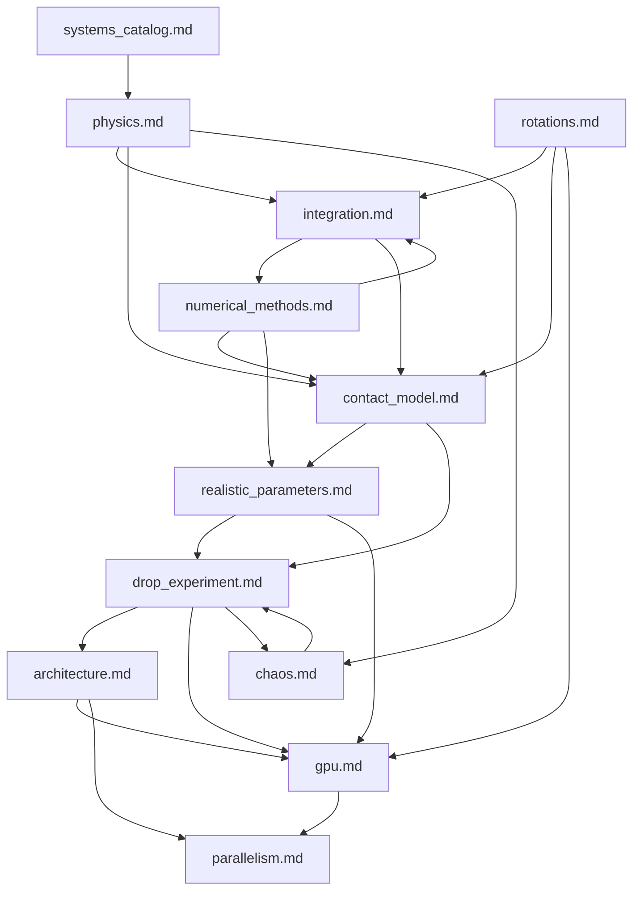

# Documentation Index

Reference manual for the **lab** computational-physics framework.
Target audience: graduate-level physicists who want to understand every computational decision.

All quantities are in SI units (metres, kilograms, seconds, radians) unless stated otherwise.

---

## Document map

| Document | What it covers |
|---|---|
| [physics.md](physics.md) | Hamiltonian mechanics as the universal interface — Hamilton's equations, Lagrangian derivation, Noether's theorem, Poisson brackets, phase-space topology, contact physics overview |
| [integration.md](integration.md) | Leapfrog (Störmer-Verlet) scheme, quaternion exponential map, constraint ordering, local/global error, modified Hamiltonian, stability, adaptive RK45, operator-splitting artefacts |
| [numerical_methods.md](numerical_methods.md) | IEEE 754, finite differences, convergence order, CFL stability, symplectic structure preservation, damping strategies, settle detection |
| [rotations.md](rotations.md) | Euler angles (and why not), rotation matrices, quaternions — representation, operations, differentiation, numerical drift, codebase map |
| [contact_model.md](contact_model.md) | The floor constraint in depth — penetration detection, normal impulse, Coulomb friction, rolling resistance, damping zones, snap-to-zero, settle detection, code mapping across all three implementations |
| [realistic_parameters.md](realistic_parameters.md) | Real-world object constants (US quarter, 16 mm die), inertia tensor derivations, scale invariance, dimensional analysis for thresholds, timestep selection, visual vs physical mesh |
| [drop_experiment.md](drop_experiment.md) | Anatomy of a drop experiment — parameter space, three execution paths (CPU/GPU/live), classification, outcome map interpretation, visualization architecture |
| [architecture.md](architecture.md) | Package layout, design philosophy, three-implementation comparison (Python OOP / Numba JIT / CUDA), constants synchronisation, testing strategy |
| [gpu.md](gpu.md) | CUDA programming model, device functions, thread indexing, memory model, the JIT counterpart, performance, troubleshooting |
| [parallelism.md](parallelism.md) | CPU multiprocessing, GPU parallelism, Amdahl's law, SIMT, memory hierarchy, real-time animation architecture |
| [chaos.md](chaos.md) | Deterministic chaos, Lyapunov exponents, fractal basins, double pendulum, coin-toss as chaos, numerical vs physical chaos, the live dashboard |
| [systems_catalog.md](systems_catalog.md) | Reference for every pre-built Hamiltonian — oscillators, pendulums, orbits, charged particles, EM waves, ray optics, rigid bodies |

---

## Entry points by interest

**"I want to understand the physics."**
Start with [physics.md](physics.md) for the Hamiltonian framework, then [rotations.md](rotations.md) for quaternion mechanics, then [contact_model.md](contact_model.md) for dissipative contact dynamics.

**"I want to understand the computation."**
Start with [numerical_methods.md](numerical_methods.md) for floating-point and finite-difference fundamentals, then [integration.md](integration.md) for the symplectic integrator, then [realistic_parameters.md](realistic_parameters.md) for how physical constants map to numerical thresholds.

**"I want to run experiments."**
Start with [drop_experiment.md](drop_experiment.md) for the experiment pipeline, then [systems_catalog.md](systems_catalog.md) for pre-built systems, then [architecture.md](architecture.md) for the package layout.

**"I want to use the GPU."**
Start with [gpu.md](gpu.md) for the CUDA implementation, then [parallelism.md](parallelism.md) for the broader parallelism picture, then [drop_experiment.md](drop_experiment.md) for the three execution paths.

**"I want to understand chaos in the coin toss."**
Start with [chaos.md](chaos.md) for the theory, then [drop_experiment.md](drop_experiment.md) for the experimental design, then [contact_model.md](contact_model.md) for why the boundary structure is fractal.

---

## Cross-reference diagram

---

## Conventions

- **Mathematics**: inline LaTeX with `$...$`, display with `$$...$$`.
- **Code references**: `module.function()` with file paths relative to the project root.
- **Units**: SI throughout. Angles in radians unless explicitly stated as degrees.
- **Cross-references**: `[topic](other_doc.md)` links within the docs directory.
