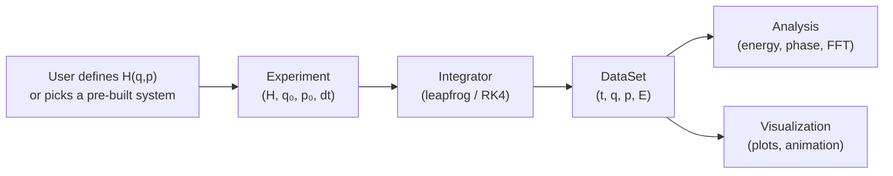

# Architecture

## Design philosophy

**One abstraction to rule them all**: the Hamiltonian $H(q, p)$.

Every classical system — from a pendulum to a planet to an electromagnetic wave — is described by a single scalar function of generalized coordinates and momenta. The framework provides time evolution, energy diagnostics, phase-space analysis, and visualization *automatically* once you supply $H$.

## Project layout

```
physics/
├── lab/                       The library
│   ├── core/                  Foundation layer
│   │   ├── hamiltonian.py     Hamiltonian class: H(q,p), ∂H/∂q, ∂H/∂p
│   │   ├── state.py           State: (q, p) arrays of arbitrary dimension
│   │   ├── integrators.py     Leapfrog (symplectic), RK4, adaptive RK45
│   │   ├── experiment.py      Experiment runner: setup → run → DataSet
│   │   ├── dataset.py         Time-indexed trajectory with convenience methods
│   │   ├── quaternion.py      Quaternion math (rotation, exp map, etc.)
│   │   └── rigid_body_jit.py  JIT-compiled rigid-body physics (single source of truth)
│   │
│   ├── systems/               Pre-built Hamiltonians
│   │   ├── oscillators.py     Harmonic, damped, driven, coupled, Duffing
│   │   ├── pendulums.py       Simple, double, spherical
│   │   ├── central_force.py   Kepler, general V(r), precessing orbits
│   │   ├── charged.py         Particle in E, B, E×B fields
│   │   ├── rigid_body/        3D rigid body engine (OOP subpackage)
│   │   │   ├── objects.py     PointParticle, RigidBody (cube/coin/rod)
│   │   │   ├── fields.py      Gravity, electric, Coulomb, drag
│   │   │   ├── constraints.py Floor constraint with contact impulse
│   │   │   ├── world.py       World + 3D leapfrog integrator
│   │   │   ├── environments.py Field presets (earth surface, etc.)
│   │   │   └── experiment.py  RigidBodyExperiment → DataSet bridge
│   │   ├── emwave.py          FDTD Maxwell solver (1D, 2D)
│   │   └── ray_optics.py      Hamiltonian ray tracer
│   │
│   ├── analysis/              Post-simulation analysis
│   │   ├── energy.py          Energy vs time, conservation error, drift
│   │   ├── phase_space.py     Phase portraits, energy contours
│   │   ├── poincare.py        Poincaré sections (stroboscopic, surface)
│   │   └── spectral.py        FFT, power spectrum, spectrogram
│   │
│   ├── visualization/         Plotting and animation
│   │   ├── sweep_grid.py      Generic 2D colour-grid (outcome maps)
│   │   ├── category_histogram.py  Generic discrete bar chart
│   │   ├── body_scene.py      3D rigid-body renderer (PyVista + mpl fallback)
│   │   ├── playback_controls.py   Pause/speed/step widgets
│   │   ├── dashboard.py       Compositor: wires primitives into live/replay/static
│   │   ├── plots.py           Time series, multi-panel diagnostics
│   │   ├── animate2d.py       2D animations (all demo types)
│   │   ├── interactive.py     Matplotlib sliders for parameter exploration
│   │   └── field_snapshot.py  FDTD field visualization and ray paths
│   │
│   └── experiments/           Experiment modules
│       ├── base.py            DropExperiment base class (sweep, live, GPU)
│       ├── coin.py            CoinDrop subclass (declarative config only)
│       ├── cube.py            CubeDrop subclass (declarative config only)
│       ├── drop_gpu.py        GPU-accelerated drop sweeps (CUDA kernel)
│       └── coin_toss.py       Legacy: coin toss OOP experiment
│
├── tests/                     Unit and integration tests
├── experiments/               Runnable experiment scripts (legacy redirects)
│   ├── coin_toss.ipynb        Coin toss interactive notebook
│   ├── drop_coin.py           Redirects to: python main.py coin
│   └── drop_cube.py           Redirects to: python main.py cube
├── results/                   Auto-saved experiment outputs (date-stamped)
├── docs/                      Documentation
├── main.py                    Experiment launcher (CLI entry point)
├── completions.bash           Bash tab-completion
├── requirements.txt           Dependencies (numpy, matplotlib, numba, CUDA, etc.)
└── Makefile                   Build targets (make help for list)
```

## Experiment-driven architecture

The rigid-body drop experiments use a clean three-layer architecture:

### Layer 1: Physics core (`lab/core/rigid_body_jit.py`)

**Single source of truth** for all rigid-body physics. Contains:
- Physical constants (coin, cube, rod dimensions and masses)
- `@njit` quaternion math (normalize, multiply, rotate, exp map)
- Lowest-point calculation per shape
- Floor constraint with normal impulse, friction, and rolling resistance
- `step_bodies()` — batch stepper that advances N bodies by M steps
- `classify()` — determines which face landed down

Every execution mode (batch CPU, live, GPU) calls these same functions. The CUDA path (`drop_gpu.py`) cannot call `@njit` functions directly (Numba limitation) but imports all constants from here.

### Layer 2: Experiments (`lab/experiments/`)

The `DropExperiment` base class defines the experiment protocol:

```python
class DropExperiment:
    # Subclass provides declarative config:
    shape: str              # "coin" or "cube"
    shape_id: int           # 0 or 1
    angle_range: tuple      # (0, π) or (0, 2π)
    colors: dict            # outcome_id → hex colour
    labels: dict            # outcome_id → display label
    settle_height: float
    body_color: str
    mesh: str               # "coin" or "cube"

    # Base class implements:
    def build_grid(nh, na, hmin, hmax)
    def sweep(heights, angles, ...)      # batch CPU
    def sweep_gpu(heights, angles, ...)  # GPU CUDA
    def run_live(heights, angles, ...)   # live dashboard
    def show_results(heights, angles, results)
```

`CoinDrop` and `CubeDrop` are thin subclasses that set attributes only — no methods. Adding a new experiment means defining one more subclass.

### Layer 3: Visualization primitives (`lab/visualization/`)

Generic, reusable components that know nothing about coins or cubes:

| Primitive | What it does | Used for |
|-----------|-------------|----------|
| `SweepGrid` | 2D colour grid (`imshow`) | Outcome maps |
| `CategoryHistogram` | Discrete bar chart | Outcome distribution |
| `BodyScene` | 3D polygon renderer (PyVista or matplotlib) | Watching bodies fall |
| `PlaybackControls` | Pause/speed/step buttons | Animation control |
| `dashboard.py` | Compositor — wires primitives + physics | All visualization modes |

The dashboard has three modes:
- **`run_live()`**: physics + 3D scene + outcome map + histogram, all updating per frame
- **`show_results()`**: static view after batch/GPU sweep
- **`run_replay()`**: animated replay with time slider

## "GPU" means two different things

**GPU Compute (CUDA)** — Numba `@cuda.jit` runs N physics simulations in parallel on NVIDIA GPU cores. Used by `drop_gpu.py`. This is about raw throughput. Input: arrays of heights/angles. Output: integer result grid.

**GPU Rendering (OpenGL)** — PyVista/VTK renders a 3D scene with hardware-accelerated polygon rendering. Used by `body_scene.py`. This is about displaying 3D objects smoothly. Input: positions/orientations per frame. Output: pixels on screen.

These are independent. You can have GPU rendering with CPU physics (live mode), or GPU compute with no rendering (batch `--gpu`).

## Execution flows

### Batch CPU (`python main.py coin`)

```
main.py → CoinDrop.sweep() → rigid_body_jit.step_bodies() → classify()
    → dashboard.show_results() → SweepGrid + CategoryHistogram
    → auto-save to results/YYYY-MM-DD_HH-MM-SS_coin_batch/
```

### Batch GPU (`python main.py coin --gpu`)

```
main.py → CoinDrop.sweep_gpu() → drop_gpu.sweep_drop_gpu() [CUDA kernel]
    → dashboard.show_results() → SweepGrid + CategoryHistogram
    → auto-save to results/YYYY-MM-DD_HH-MM-SS_coin_gpu/
```

### Live dashboard (`python main.py coin --live`)

```
main.py → CoinDrop.run_live() → dashboard.run_live()
    → FuncAnimation loop:
        rigid_body_jit.step_bodies() per frame
        BodyScene.update_all() [OpenGL GPU or matplotlib CPU]
        SweepGrid.update() + CategoryHistogram.update()
```

## Auto-saving results

Every batch and GPU run saves output to a dated folder:

```
results/
  2026-03-02_14-35-12_coin_batch/
    outcome_map.png
    parameters.json        # nh, na, hmin, hmax, axis, mode, elapsed_time
  2026-03-02_15-01-44_cube_gpu/
    outcome_map.png
    parameters.json
```

## Constants synchronisation

Physical constants live in ONE place: `lab/core/rigid_body_jit.py`. The GPU module imports them:

```python
# In drop_gpu.py:
from lab.core.rigid_body_jit import COIN_RADIUS, COIN_MASS, ...
_COIN_R = COIN_RADIUS  # aliased for CUDA device function closure
```

CUDA device functions capture these at compile time. Changing a constant in `rigid_body_jit.py` propagates to GPU after clearing `__pycache__`.

## Data flow



## Separation of concerns

| Layer | Knows about | Does not know about |
|-------|-------------|---------------------|
| **Core** | numpy arrays, calculus | specific systems, plots |
| **Systems** | physics of one system | integrators, visualization |
| **Analysis** | DataSet structure | which system produced it |
| **Visualization** | matplotlib, DataSet | physics details |
| **Experiments** | their own config (colors, labels) | chart drawing, physics internals |

## The Hamiltonian interface

```python
class Hamiltonian:
    ndof: int                          # degrees of freedom
    H(q, p) -> float                   # total energy
    grad_q(q, p) -> ndarray            # ∂H/∂q (force = -grad_q)
    grad_p(q, p) -> ndarray            # ∂H/∂p (velocity = grad_p)
    kinetic(q, p) -> float             # T
    potential(q, p) -> float           # V
    coords: list[str]                  # coordinate names
    vis_hint: dict                     # hints for visualisation dispatch
```

Gradients are computed automatically via central finite differences unless you provide analytical overrides (which all built-in systems do for performance).

## Integrator choice

| Integrator | Symplectic | Order | Use when |
|-----------|-----------|-------|----------|
| `leapfrog` | Yes | 2 | Separable Hamiltonians, long simulations |
| `rk4` | No | 4 | Non-separable H (double pendulum, cyclotron) |
| `rk45_adaptive` | No | 4-5 | Unknown timescales, varying dynamics |

**Default: leapfrog.** For separable Hamiltonian systems ($H = T(p) + V(q)$), the leapfrog integrator preserves the symplectic structure of phase space, keeping energy bounded rather than drifting. For non-separable systems (where $T$ depends on both $q$ and $p$), RK4 gives better per-step accuracy.

## Usage

```
python main.py coin                    # CPU batch sweep
python main.py coin --gpu              # GPU (CUDA) sweep
python main.py coin --live             # live dashboard
python main.py cube --nh 20 --na 30    # custom grid size
python main.py                         # show help
```

## Tests

Over 100 tests covering core abstractions, all systems, rigid body engine, FDTD, ray optics, and the coin toss experiment:

```
python -m pytest tests/ -v
```
