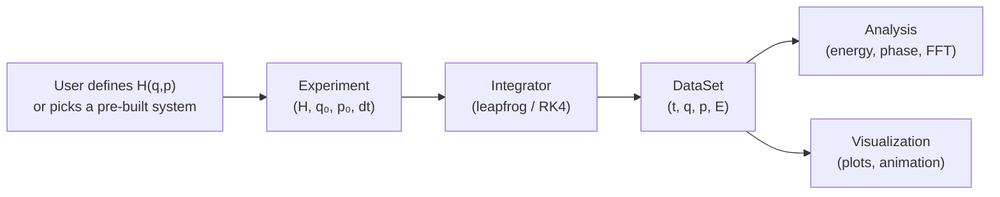

# Architecture

## Design philosophy

**One abstraction to rule them all**: the Hamiltonian $H(q, p)$.

Every classical system — from a pendulum to a planet to an electromagnetic wave — is described by a single scalar function of generalized coordinates and momenta. The framework provides time evolution, energy diagnostics, phase-space analysis, and visualization *automatically* once you supply $H$.

## Project layout

```
physics/
├── lab/                       The library
│   ├── core/                  Foundation layer
│   │   ├── hamiltonian.py     Hamiltonian class: H(q,p), ∂H/∂q, ∂H/∂p
│   │   ├── state.py           State: (q, p) arrays of arbitrary dimension
│   │   ├── integrators.py     Leapfrog (symplectic), RK4, adaptive RK45
│   │   ├── experiment.py      Experiment runner: setup → run → DataSet
│   │   ├── dataset.py         Time-indexed trajectory with convenience methods
│   │   └── quaternion.py      Quaternion math (rotation, exp map, etc.)
│   │
│   ├── systems/               Pre-built Hamiltonians
│   │   ├── oscillators.py     Harmonic, damped, driven, coupled, Duffing
│   │   ├── pendulums.py       Simple, double, spherical
│   │   ├── central_force.py   Kepler, general V(r), precessing orbits
│   │   ├── charged.py         Particle in E, B, E×B fields
│   │   ├── rigid_body/        3D rigid body engine (subpackage)
│   │   │   ├── objects.py     PointParticle, RigidBody (cube/coin/rod)
│   │   │   ├── fields.py      Gravity, electric, Coulomb, drag
│   │   │   ├── constraints.py Floor constraint with contact impulse
│   │   │   ├── world.py       World + 3D leapfrog integrator
│   │   │   ├── environments.py Field presets (earth surface, etc.)
│   │   │   └── experiment.py  RigidBodyExperiment → DataSet bridge
│   │   ├── emwave.py          FDTD Maxwell solver (1D, 2D)
│   │   └── ray_optics.py      Hamiltonian ray tracer
│   │
│   ├── analysis/              Post-simulation analysis
│   │   ├── energy.py          Energy vs time, conservation error, drift
│   │   ├── phase_space.py     Phase portraits, energy contours
│   │   ├── poincare.py        Poincaré sections (stroboscopic, surface)
│   │   └── spectral.py        FFT, power spectrum, spectrogram
│   │
│   ├── visualization/         Plotting and animation
│   │   ├── plots.py           Time series, multi-panel diagnostics
│   │   ├── animate2d.py       2D animations (all demo types)
│   │   ├── interactive.py     Matplotlib sliders for parameter exploration
│   │   └── field_snapshot.py  FDTD field visualization and ray paths
│   │
│   └── experiments/           Experiment modules
│       ├── coin_toss.py       Coin toss: deterministic chaos demo
│       └── drop_experiment.py Parallel rigid-body drop sweeps
│
├── tests/                     106 unit and integration tests
├── experiments/               Runnable experiment scripts
│   ├── coin_toss.ipynb        Coin toss interactive notebook
│   ├── drop_coin.py           Coin drop outcome map (height × tilt)
│   ├── drop_cube.py           Cube drop outcome map (height × tilt)
│   └── drop_rod.py            Rod drop outcome map (height × tilt)
├── docs/                      Documentation
├── main.py                    CLI demo launcher
├── completions.bash           Bash tab-completion for demos
└── requirements.txt           numpy, matplotlib, pytest
```

## Data flow



## Separation of concerns

| Layer | Knows about | Does not know about |
|-------|-------------|---------------------|
| **Core** | numpy arrays, calculus | specific systems, plots |
| **Systems** | physics of one system | integrators, visualization |
| **Analysis** | DataSet structure | which system produced it |
| **Visualization** | matplotlib, DataSet | physics details |

This means you can:
- Add a new system without touching any analysis or visualization code
- Swap integrators without changing any system
- Plot any system's results with the same functions

## The Hamiltonian interface

```python
class Hamiltonian:
    ndof: int                          # degrees of freedom
    H(q, p) -> float                   # total energy
    grad_q(q, p) -> ndarray            # ∂H/∂q (force = -grad_q)
    grad_p(q, p) -> ndarray            # ∂H/∂p (velocity = grad_p)
    kinetic(q, p) -> float             # T
    potential(q, p) -> float           # V
    coords: list[str]                  # coordinate names
    vis_hint: dict                     # hints for visualisation dispatch
```

Gradients are computed automatically via central finite differences unless you provide analytical overrides (which all built-in systems do for performance).

## Integrator choice

| Integrator | Symplectic | Order | Use when |
|-----------|-----------|-------|----------|
| `leapfrog` | Yes | 2 | Separable Hamiltonians, long simulations |
| `rk4` | No | 4 | Non-separable H (double pendulum, cyclotron) |
| `rk45_adaptive` | No | 4-5 | Unknown timescales, varying dynamics |

**Default: leapfrog.** For separable Hamiltonian systems ($H = T(p) + V(q)$), the leapfrog integrator preserves the symplectic structure of phase space, keeping energy bounded rather than drifting. For non-separable systems (where $T$ depends on both $q$ and $p$), RK4 gives better per-step accuracy.

## Visualization dispatch

The `animate()` function in `animate2d.py` reads the Hamiltonian's `vis_hint` and dispatches to the right animator:

| `vis_hint["type"]` | Animator | Systems |
|---|---|---|
| `spring` | Spring-mass + time trace | Harmonic oscillator |
| `coupled_spring` | Two masses + springs | Coupled oscillators |
| `pendulum` | Swinging rod with trail | Simple pendulum |
| `double_pendulum` | Two-link chain with trail | Double pendulum |
| `orbit` | Polar → Cartesian trace | Kepler, central force |
| `particle_3d` | Top-down x-y trace | Cyclotron, E-field |
| `rigid_drop` | Side-view rotating body | Cube, coin, rod drops |

EM waves and ray optics use dedicated visualizers in `field_snapshot.py`.

## Special cases

### Rigid bodies

Rigid body dynamics (3D position + quaternion orientation + angular momentum) don't map to scalar $(q, p)$ arrays. The `rigid_body` subpackage provides its own `World` integrator (3D leapfrog with quaternion rotation) and a `RigidBodyExperiment` that outputs a standard `DataSet` with $q = [x, y, z, q_w, q_x, q_y, q_z]$, so all analysis and visualization tools still work.

### FDTD electromagnetic waves

The FDTD solver operates on field grids rather than particles. It has its own `FDTDGrid1D`/`FDTDGrid2D` classes and returns an `FDTDDataSet`. The visualization module `field_snapshot` handles these natively. Conceptually, FDTD is still a leapfrog scheme — E and B fields are staggered in time, exactly like position and momentum.

### Ray optics

Geometric optics fits the Hamiltonian framework directly: $H = |p| / n(q)$. Light rays are just particles whose "potential" comes from the refractive index field. Uses the standard `Experiment` runner and `DataSet`.

## Demos

Run `python main.py` for the full list. Each demo creates a system, runs a simulation, and shows an animated matplotlib window:

```
python main.py oscillator    spring-mass animation
python main.py coupled       two coupled oscillators
python main.py pendulum      swinging pendulum
python main.py double        double pendulum (chaos)
python main.py kepler        Kepler orbit tracing
python main.py cyclotron     charged particle in B field
python main.py drop [shape]  rigid body drop (cube/coin/rod)
python main.py emwave        EM pulse through a dielectric
python main.py rays          light rays through a lens
```

## Experiments

Standalone scripts in `experiments/` run larger parameter sweeps, using CPU multiprocessing for parallel execution:

```
python experiments/drop_coin.py              # coin: 40×60 grid, all CPUs
python experiments/drop_cube.py --nh 60 --na 90   # cube: finer grid
python experiments/drop_rod.py  --axis z --workers 4
```

Each prints real-time progress (percentage, elapsed time, ETA) and shows a color-coded outcome map at the end.

## Tests

106 tests covering core abstractions, all systems, rigid body engine, FDTD, ray optics, and the coin toss experiment:

```
python -m pytest tests/ -v
```
