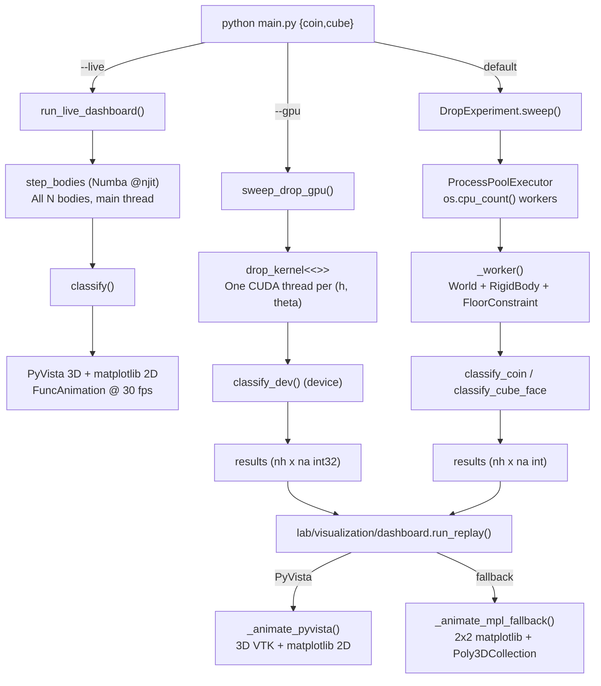
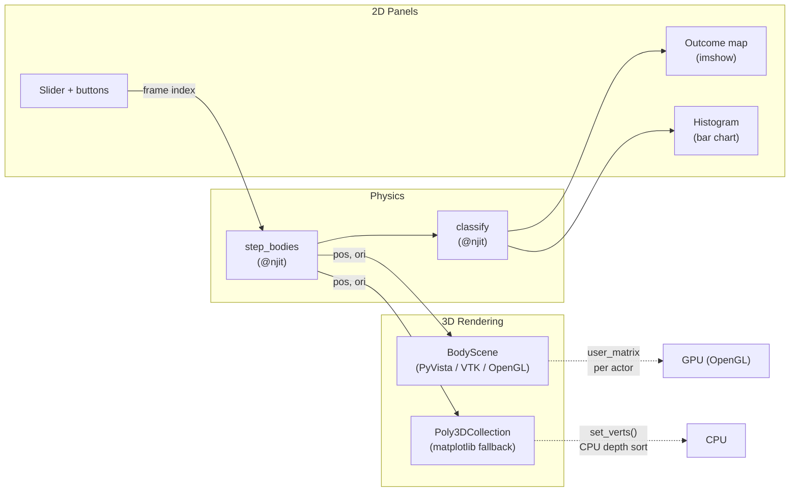

# Drop Experiment Reference

> Anatomy of a rigid-body drop experiment: parameter space, execution
> paths, classification, outcome maps, and visualization.

**See also:** [chaos.md](chaos.md) | [contact_model.md](contact_model.md) |
[realistic_parameters.md](realistic_parameters.md) |
[architecture.md](architecture.md) | [gpu.md](gpu.md)

---

## 1. The scientific question

A coin toss is deterministic.  Given the drop height $h$ and initial
tilt angle $\theta$, the question

> *Which face lands up?*

has a definite answer.  The mapping $(h, \theta) \mapsto \text{outcome}$
is a well-defined function of the initial conditions.  What makes the
problem interesting is the *structure* of that function.

The boundary between "heads" and "tails" regions in the
$(h, \theta)$ plane is not a smooth curve.  It is a fractal.  Zoom in
on any segment of the boundary and you find ever-finer interleaving of
heads and tails domains.  This is the signature of **deterministic
chaos**: the system is governed by exact differential equations with no
randomness, yet the outcome is exquisitely sensitive to initial
conditions near the basin boundary.

The mathematical framework is that of **fractal basins of attraction**
in nonlinear dynamics.  Each final resting state (heads, tails, edge
for a coin; one of six faces for a cube) defines a basin of attraction
in the space of initial conditions.  The boundaries between basins have
fractal dimension $d > 1$, meaning that the set of "undecidable"
initial conditions --- those for which an arbitrarily small perturbation
can flip the outcome --- has nonzero measure at every scale.

This is *not* randomness.  It is deterministic unpredictability.  The
distinction matters: for any *specific* $(h, \theta)$ the outcome is
reproducible to machine precision, but *predicting* the outcome from
approximate initial conditions requires resolving the fractal boundary,
which demands exponentially increasing precision as you approach it.
See [chaos.md](chaos.md) for the Lyapunov exponent analysis and the
connection to symbolic dynamics.

---

## 2. Parameter space

A drop experiment sweeps a 2D grid over two control variables.

### Height $h$

Drop height controls the impact energy.  Neglecting air resistance
and pre-impact rotation, the kinetic energy at impact is

$$
  KE_{\text{impact}} = mgh
$$

where $m$ is the body mass and $g = 9.81\;\text{m/s}^2$.  A taller drop
delivers more energy to the floor collision, enabling more complex
post-impact dynamics: multiple bounces, tumbling, spin-up from friction
torques.  This complexity is what generates the fractal basin structure.

**Typical range:** $h \in [0.5, 5.0]$ m.  Below $0.5$ m most
bodies settle on the first or second bounce; above $5.0$ m the
fractal structure is fully developed and additional height adds
resolution without qualitative change.

### Angle $\theta$

The initial tilt angle controls the body's orientation at release.
The angle is applied as a rotation about a user-specified axis
(default: $x$-axis) via

$$
  q_0 = \cos\!\frac{\theta}{2}
       + \sin\!\frac{\theta}{2}\;\hat{a}
$$

where $\hat{a}$ is the unit axis vector and $q_0$ is the initial
orientation quaternion.  See [rotations.md](rotations.md) for
conventions.

**Typical range:** $\theta \in [-\pi/4,\; \pi/4]$ rad.  For a full
exploration, the CLI scripts default to $[0, 2\pi)$.

### The 2D sweep grid

The parameter sweep discretises the two axes into an
$n_h \times n_a$ grid.  Each grid point $(h_i, \theta_j)$ is one
independent simulation.

| Parameter | CLI flag | Default | Notes |
|-----------|----------|---------|-------|
| $n_h$ | `--nh` | 8 (lib) / 40 (CLI) | Height grid points |
| $n_a$ | `--na` | 12 (lib) / 60 (CLI) | Angle grid points |
| $h_{\min}$ | `--hmin` | 0.1 m | Lowest drop height |
| $h_{\max}$ | `--hmax` | 5.0 m | Highest drop height |
| axis | `--axis` | `x` | Rotation axis for $\theta$ |

Total simulation count is $N = n_h \times n_a$.  Default CLI grids
give $40 \times 60 = 2400$ simulations.  Higher resolution reveals
finer fractal structure at the basin boundaries.

---

## 3. Three execution paths

All three paths solve the same physics (leapfrog integration with
floor constraint, friction, and rolling resistance) and produce the
same $n_h \times n_a$ integer outcome matrix.  They differ in how
the simulations are parallelised and displayed.

### CPU batch (`ProcessPoolExecutor`)

**Module:** `lab/experiments/base.py::DropExperiment.sweep`

Each $(h, \theta)$ pair runs as an independent Python process using
the full OOP physics stack: `World` + `RigidBody` + `GravityField` +
`FloorConstraint`.

- Parallelised with `concurrent.futures.ProcessPoolExecutor`.
- Workers: `os.cpu_count()` by default, override with `--workers`.
- An optional `callback(i, j, result, done, total)` fires after each
  simulation completes, enabling progressive rendering.
- Best for **small-to-medium grids** ($N < 1000$) on machines without
  an NVIDIA GPU.

**Invocation:**

```bash
python main.py coin --nh 20 --na 30
python main.py cube --nh 20 --na 30 --workers 8
```

### GPU (CUDA kernel)

**Module:** `lab/experiments/drop_gpu.py::sweep_drop_gpu`

One CUDA thread per $(h, \theta)$ pair.  The quaternion math,
leapfrog integrator, floor constraint (normal impulse, Coulomb
friction, rolling resistance), and settle detection are reimplemented
as CUDA `@cuda.jit(device=True)` functions.  All simulations run
simultaneously on the GPU.

- Thread block: $16 \times 16$.  Grid dimensions:
  $\lceil n_h / 16 \rceil \times \lceil n_a / 16 \rceil$.
- Settle detection uses the same kinetic energy threshold as the CPU
  path: $KE < 10^{-4}\,m g\,h_{\text{settle}}$ for 200 consecutive
  steps.
- **Requires** NVIDIA GPU + `numba`, `nvidia-cuda-nvcc-cu12`,
  `nvidia-cuda-runtime-cu12`.
- Best for **massive grids** ($N \geq 1000$).  Speedup over CPU
  batch is typically $50\text{--}200\times$ for $N > 10{,}000$.

**Invocation:**

```bash
python main.py coin --gpu --nh 100 --na 200
python main.py cube --gpu --nh 200 --na 300
```

### Live dashboard (`FuncAnimation` + JIT)

**Module:** `lab/visualization/dashboard.py::run_live_dashboard`

All $N$ bodies are simulated simultaneously in a single
Numba-compiled function `step_bodies`, which runs on the CPU but at
near-C speed.  No `ProcessPoolExecutor`, no CUDA --- everything
executes on the main thread.

- **Physics:** Numba `@njit` scalar functions implementing the same
  leapfrog + floor constraint math as the GPU kernel.
- **Visualization (PyVista path):** A dedicated
  `lab/visualization/body_scene.py::BodyScene` window renders
  all $N$ bodies as VTK actors on a GPU-accelerated OpenGL floor.
  A separate matplotlib window shows the 2D outcome map and histogram.
- **Visualization (fallback):** When PyVista is not installed, a
  `2 \times 2` matplotlib layout uses `Poly3DCollection` for CPU
  depth-sorted 3D rendering.
- **Adaptive stepping:** `steps_per_frame` scales as
  $\max(\text{base}, \text{base} \times N / n_{\text{alive}})$, so
  fewer alive bodies means more physics per animation frame.
- **Controls:** pause/resume button, speed slider ($0.25\text{--}4\times$).
- Best for **visual exploration and presentations**.

**Invocation:**

```bash
python main.py coin --live --nh 8 --na 12
python main.py cube --live --nh 10 --na 15
```

### Flowchart: CLI to result



---

## 4. Classification

After a body settles (kinetic energy below threshold for a sustained
count), its final quaternion $q_f = (w, x, y, z)$ is classified into
a discrete outcome.

### Coin

Rotate the body-frame $\hat{y}$ axis into the world frame:

$$
  \mathbf{v}_y^{\text{world}} = q_f \,\hat{y}\, q_f^*
$$

The world-$y$ component (vertical) determines the outcome:

| Condition | Outcome | Code |
|-----------|---------|------|
| $v_y^{\text{world}} > 0.1$ | Heads | $+1$ |
| $v_y^{\text{world}} < -0.1$ | Tails | $-1$ |
| otherwise | Edge | $0$ |

The $\pm 0.1$ dead zone prevents misclassification when the coin
rests nearly vertical.

**CPU:** `classify_coin(orientation)` in `base.py`.
**JIT:** `classify(0, qw, qx, qy, qz)` in `lab/core/rigid_body_jit.py`.
**GPU:** `classify_coin_dev(qw, qx, qy, qz)` in `drop_gpu.py`.

### Cube

Extract the second row of the rotation matrix (the world-$y$
components of all body-frame axes):

$$
  R = q_f \to 3\times3, \qquad
  \text{row}_1 = (R_{10},\; R_{11},\; R_{12})
$$

The six body-frame axis directions $\pm\hat{x}, \pm\hat{y},
\pm\hat{z}$ project onto $y^{\text{world}}$ as:

| Axis | World-$y$ component |
|------|---------------------|
| $+\hat{x}$ | $R_{10}$ |
| $-\hat{x}$ | $-R_{10}$ |
| $+\hat{y}$ | $R_{11}$ |
| $-\hat{y}$ | $-R_{11}$ |
| $+\hat{z}$ | $R_{12}$ |
| $-\hat{z}$ | $-R_{12}$ |

The face whose axis has the **most negative** world-$y$ component
points most downward and is the resting face.  The return value is a
face index 0--5 corresponding to $+x, -x, +y, -y, +z, -z$.

**CPU:** `classify_cube_face(orientation)` in `base.py`.
**JIT:** `classify(1, qw, qx, qy, qz)` in `lab/core/rigid_body_jit.py`.
**GPU:** `classify_cube_dev(qw, qx, qy, qz)` in `drop_gpu.py`.

### Summary of classification codes

| Shape | Outcomes | Values | Colour scheme |
|-------|----------|--------|---------------|
| Coin | Heads, Tails, Edge | $+1, -1, 0$ | Blue, red, grey |
| Cube | 6 faces | $0\text{--}5$ | Blue pair, red pair, green pair |

---

## 5. The outcome map

### What the RGB image means

Each pixel in the outcome map corresponds to one $(h_i, \theta_j)$
simulation.  The horizontal axis is $\theta$ (converted to degrees for
display), the vertical axis is $h$.  Pixel colour encodes the discrete
outcome: blue for heads, red for tails, grey for edge (coin); paired
hues for the six faces (cube).

The function `_results_to_rgb(results, colors)` in `base.py`
converts the integer outcome grid to an $(n_h, n_a, 3)$ floating-point
RGB array, displayed with `imshow(origin="lower")` so that height
increases upward.

### Why the boundaries are fractal

At low heights the outcome map contains large, simply-connected colour
regions: the body hits the floor once and settles.  As $h$ increases
the regions fragment.  Near any boundary, a perturbation
$\delta\theta \sim \varepsilon$ can switch the outcome.  The number
of post-impact bounces grows, and each bounce amplifies the
sensitivity to initial orientation.

This is **sensitive dependence on initial conditions** localised at
the basin boundaries.  The interior of each basin is smooth --- a small
perturbation deep inside "heads" territory still yields heads.  Only
at the boundary does the system exhibit chaotic sensitivity.  The
fractal dimension of the boundary set quantifies how "thick" the
undecidable region is; for typical drop parameters it lies strictly
between 1 and 2.  See [chaos.md](chaos.md) for the box-counting
analysis and Lyapunov exponent estimates.

### What the histogram reveals

The histogram panel counts the number of pixels (simulations) that
landed in each outcome category.  For a coin:

- A "fair" region of parameter space yields heads $\approx$ tails
  $\approx 50\%$, with a thin edge sliver.
- The edge fraction is negligible except at very low $h$ where the
  coin lacks enough energy to topple.

For a cube:

- Six faces compete.  The histogram reveals which faces are
  **favoured** for the chosen height and angle range.
- Symmetry-related face pairs (e.g., $+y$ and $-y$) often have
  similar counts.  Asymmetry indicates the tilt axis breaks the
  discrete symmetry of the cube.

---

## 6. Visualization architecture

The codebase provides two rendering tiers, selected at runtime based
on whether PyVista is installed.

### Live dashboard (PyVista + matplotlib)

**Entry:** `run_live_dashboard()` in `lab/visualization/dashboard.py`, dispatching
to `_run_pyvista_live()`.

Two windows run simultaneously:

1. **PyVista window** (`lab/visualization/body_scene.py::BodyScene`)
   - All $N$ bodies rendered as VTK actors on an OpenGL floor plane.
   - Each body shares a template mesh (`pv.Cylinder` for coin,
     `pv.Box` for cube) but has its own `user_matrix` --- a $4\times4$
     affine transform updated every frame from the physics state.
   - **Coordinate swap:** physics uses $y$-up; display uses $z$-up.
     The `build_user_matrix()` function conjugates the rotation matrix
     by the $y \leftrightarrow z$ swap matrix $S$ so that:
     $\text{display} = (x_{\text{phys}} + o_x,\;
     z_{\text{phys}} + o_z,\; y_{\text{phys}})$.
   - Settled bodies are frozen at their final transform and recoloured
     by outcome via `mark_settled(k, color)`.
   - `show_nonblocking()` opens the VTK render window and returns
     immediately; `render()` pushes one frame via
     `iren.process_events()` + `plotter.render()`.
   - **Visual mesh scale:** the real coin (radius 12.13 mm) and die
     (side 16 mm) are too small to see.  Display meshes use
     `VIS_COIN_RADIUS = 0.15 m` and `VIS_CUBE_HALF = 0.15 m`.  Physics
     runs at real dimensions.

2. **Matplotlib window** ($1\times2$ layout)
   - Left panel: outcome map (`imshow`), updated progressively as
     bodies settle.
   - Right panel: histogram, bar heights update in real time.
   - Bottom strip: pause/resume button + speed slider.
   - `FuncAnimation` drives the loop at ~30 fps (`interval=30` ms).
     Each frame calls `step_bodies()` with an adaptive step count and
     then refreshes both the 3D scene and the 2D panels.

**Fallback (no PyVista):** `run_live_dashboard()` falls back to a
pure matplotlib layout using `Poly3DCollection` for CPU depth-sorted
3D rendering.  Layout: $2 \times 2$ grid --- physical scene (3D),
scatter plot (3D), outcome map, histogram --- plus a control strip.
Functional but significantly slower for $N > 100$ because matplotlib
performs depth sorting on the CPU for every polygon every frame.

### Batch result viewer (`run_replay`)

**Module:** `lab/visualization/dashboard.py::run_replay`

Pre-computed results displayed with time-synchronised playback
controls.  `run_replay()` dispatches to `_animate_pyvista()`
or `_animate_mpl_fallback()` based on PyVista availability.

**Outcome map and histogram:** shown immediately with all results
(the sweep has already completed).

**3D physics animation:** re-simulates the entire grid forward using
the batch stepper in `lab/core/rigid_body_jit.py`.  This provides frame-accurate
physics replay without storing the full trajectory of every body.

**Time controls:**

| Control | Behaviour |
|---------|-----------|
| Time slider | Scrub to any frame.  Physics re-simulates from the nearest cached state (rewinds to $t=0$ if slider moves backward). |
| Play | Wall-clock synchronised: uses `time.monotonic()` to advance simulation time in real time, so 1 second of animation = 1 second of physics. |
| Pause | Freezes the current frame. |
| Step forward/back | Advance or retreat by one frame. |
| Rewind (implicit) | Moving the slider backward resets all physics state and re-simulates forward to the target frame. |

**PyVista path** (`_animate_pyvista`):

- `BodyScene` manages the 3D window with the same `user_matrix`
  mechanism as the live dashboard.
- Settled bodies are coloured by their pre-computed outcome.
- The matplotlib figure contains the outcome map, histogram, slider,
  and play/pause/step buttons.
- `FuncAnimation(interval=33)` drives the animation loop.

**Matplotlib fallback** (`_animate_mpl_fallback`):

- $2 \times 3$ grid layout: 3D `Poly3DCollection` scene, outcome map,
  histogram, plus a slider row.
- Same playback controls and wall-clock synchronisation.
- Each frame calls `_transform_mesh()` and `set_verts()` for every
  body, plus `set_facecolors()` for settled bodies.

### Architecture diagram



---

## Appendix A. Physical parameters

The CPU path uses the OOP `RigidBody` factory methods with generic
parameters (e.g., coin radius 0.15 m, mass 1 kg).  The JIT and GPU
paths use realistic SI dimensions:

| Body | Modelled as | Radius / Half-side | Mass |
|------|-------------|-------------------|------|
| Coin | US quarter | $r = 12.13$ mm, $h_t = 0.875$ mm | 5.67 g |
| Cube | Casino die (16 mm) | $h_s = 8$ mm | 8 g |

See [realistic_parameters.md](realistic_parameters.md) for the
derivation of inertia tensors and the physical justification of the
contact model parameters (restitution, friction, rolling resistance).

## Appendix B. Coordinate conventions

| Axis | Physics frame | Display frame (PyVista) |
|------|--------------|------------------------|
| Horizontal 1 | $x$ | $x$ |
| Vertical (height) | $y$ | $z$ |
| Horizontal 2 | $z$ | $y$ |

The swap is handled by `build_user_matrix()` in `body_scene.py`,
which conjugates the physics rotation matrix by $S$:

$$
  R_{\text{display}} = S \, R_{\text{physics}} \, S^{-1}
$$

where $S$ permutes the second and third rows/columns.  Translation
follows the same mapping:
$\text{display} = (x + o_x,\; z + o_z,\; y)$.

## Appendix C. Settle detection

A body is considered settled when **both** conditions hold for a
sustained count of consecutive timesteps:

1. Total kinetic energy (translational + rotational) falls below a
   shape-dependent threshold:
   $$
     KE = \frac{|\mathbf{p}|^2}{2m}
        + \frac{1}{2}\!\left(
            \frac{L_x^2}{I_x} + \frac{L_y^2}{I_y} + \frac{L_z^2}{I_z}
          \right)
        < \epsilon \, m g \, h_{\text{settle}}
   $$
   where $\epsilon = 10^{-4}$ and $h_{\text{settle}}$ is a few
   multiples of the body's characteristic size.

2. The centre-of-mass height $y$ is below $h_{\text{settle}}$.

The CPU path requires 200 consecutive steps; the JIT/live path uses
100 (fast settle) or 5000 (slow settle for bodies near the floor but
still moving).  The GPU kernel uses 200.

See [contact_model.md](contact_model.md) for the full floor constraint
derivation and [gpu.md](gpu.md) for the CUDA implementation details.

## Appendix D. Quick-start recipes

**Minimal coin sweep (CPU):**

```bash
python main.py coin --nh 8 --na 12
```

**High-resolution cube sweep (GPU):**

```bash
python main.py cube --gpu --nh 200 --na 300
```

**Live dashboard for presentations:**

```bash
python main.py coin --live --nh 8 --na 12
```

**Programmatic usage:**

```python
import numpy as np
from lab.experiments.coin import CoinDrop

exp = CoinDrop()
heights = np.linspace(0.5, 5.0, 20)
angles  = np.linspace(-np.pi/4, np.pi/4, 30)

results = exp.sweep(heights, angles, tilt_axis="x")
exp.show_results(heights, angles, results, tilt_axis="x")
```
