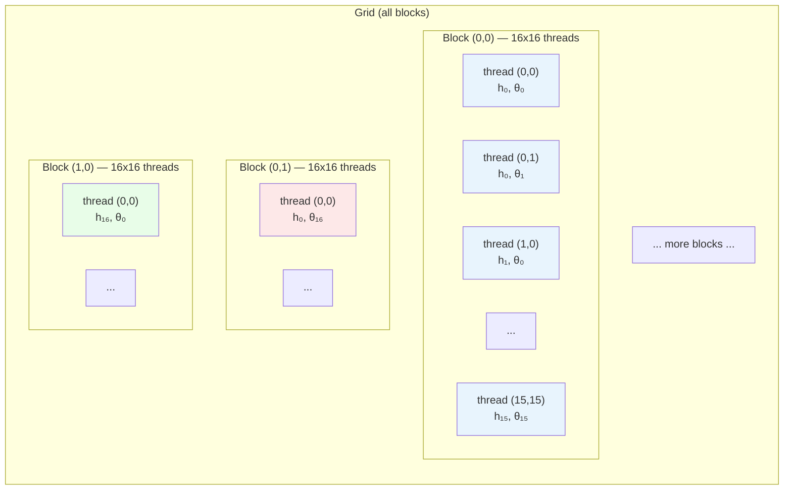
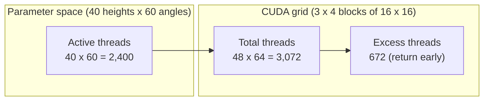

# GPU-Accelerated Simulation with CUDA

**Prerequisite**: You have read `docs/physics.md` (Hamiltonian mechanics) and
`docs/rotations.md` (quaternions). You have an NVIDIA GPU (e.g. RTX 3080) and
want to understand how `lab/experiments/drop_gpu.py` runs tens of thousands of
rigid-body simulations in parallel.

---

## 1. The CUDA programming model

A GPU is not a single fast processor — it is thousands of small processors
designed to run the *same* instructions on different data simultaneously.
CUDA organises this parallelism into two distinct execution contexts:

- **Host code** runs on the CPU. It allocates memory, prepares input arrays,
  and *launches* GPU work.
- **Device code** runs on the GPU. It cannot call arbitrary Python, use
  objects, or print to your terminal. It executes raw numeric operations.

In Numba, a **kernel** is a device function launched from the host using
bracket syntax:

```python
kernel[blocks_per_grid, threads_per_block](arg1, arg2, ...)
```

This is the bridge between the two worlds. The CPU tells the GPU "run this
function with this many parallel threads," then waits (or continues doing
other work) until the GPU finishes.

### Thread hierarchy

CUDA organises threads into a three-level hierarchy:

| Level  | What it is                              | Typical size    |
|--------|-----------------------------------------|-----------------|
| Thread | One execution unit running the kernel   | 1 simulation    |
| Block  | A group of threads that can share memory| 256 (16 x 16)  |
| Grid   | All blocks for one kernel launch        | covers the full parameter space |

In our drop experiment, each thread simulates one (height, angle) pair. The
grid has exactly enough threads to cover every combination:



The key insight: thread `(i, j)` in block `(bx, by)` maps to the global
parameter indices `(height_idx, angle_idx)`. No thread needs to know what
any other thread is doing — they are fully independent.

---

## 2. Device functions vs kernels

CUDA distinguishes two kinds of GPU functions:

### Kernels — launched FROM the CPU

Decorated with `@cuda.jit` (no arguments), a kernel is the entry point.
The CPU calls it with the grid/block dimensions. It cannot return a value;
instead, it writes results into device arrays.

From `lab/experiments/drop_gpu.py`:

```python
@cuda.jit
def drop_kernel(
    heights, angles,
    axis_x, axis_y, axis_z,
    shape_id,
    dt, n_max_steps,
    restitution, friction, rolling_resistance,
    g,
    results,
):
    i, j = cuda.grid(2)
    if i >= heights.shape[0] or j >= angles.shape[0]:
        return
    # ... run full simulation for (heights[i], angles[j]) ...
    results[i, j] = classify_dev(shape_id, qw, qx, qy, qz)
```

The kernel receives flat arrays and scalars — no Python objects, no classes,
no strings. It writes one integer into `results[i, j]`.

### Device functions — called ON the GPU

Decorated with `@cuda.jit(device=True)`, these are helper functions that run
*inside* a kernel. They can take and return values normally, but they are
never called from the CPU.

Our quaternion library is a set of device functions:

```python
@cuda.jit(device=True)
def quat_multiply(w1, x1, y1, z1, w2, x2, y2, z2):
    return (
        w1*w2 - x1*x2 - y1*y2 - z1*z2,
        w1*x2 + x1*w2 + y1*z2 - z1*y2,
        w1*y2 - x1*z2 + y1*w2 + z1*x2,
        w1*z2 + x1*y2 - y1*x2 + z1*w2,
    )

@cuda.jit(device=True)
def quat_normalize(w, x, y, z):
    n = math.sqrt(w * w + x * x + y * y + z * z)
    if n < 1e-15:
        return 1.0, 0.0, 0.0, 0.0
    inv = 1.0 / n
    return w * inv, x * inv, y * inv, z * inv
```

These look like ordinary Python, but Numba compiles them to PTX (GPU machine
code). The `math.sqrt` call compiles to a single GPU instruction — it does
not call CPython's math library.

The call chain is:

$$
\text{CPU} \xrightarrow{\text{launch}} \texttt{drop\_kernel}
\xrightarrow{\text{calls}} \texttt{quat\_multiply},\;
\texttt{floor\_constraint},\; \ldots
$$

Device functions compose freely. `floor_constraint` calls `lowest_point`,
which calls `quat_rotate_vector`, which calls `quat_multiply` and
`quat_conjugate`. The GPU inlines all of this at compile time.

---

## 3. Thread indexing

Every thread needs to know *which* simulation it is responsible for. CUDA
provides built-in variables:

| Variable           | Meaning                                  |
|--------------------|------------------------------------------|
| `cuda.threadIdx.x` | Thread index within its block (x-dim)   |
| `cuda.threadIdx.y` | Thread index within its block (y-dim)   |
| `cuda.blockIdx.x`  | Block index within the grid (x-dim)     |
| `cuda.blockIdx.y`  | Block index within the grid (y-dim)     |
| `cuda.blockDim.x`  | Number of threads per block (x-dim)     |
| `cuda.blockDim.y`  | Number of threads per block (y-dim)     |

The global index is:

$$
i = \texttt{blockIdx.x} \times \texttt{blockDim.x} + \texttt{threadIdx.x}
$$

$$
j = \texttt{blockIdx.y} \times \texttt{blockDim.y} + \texttt{threadIdx.y}
$$

Numba provides a shorthand that computes both at once:

```python
i, j = cuda.grid(2)
```

This single line gives each thread its unique `(height_idx, angle_idx)` pair.

### Bounds checking

Because the grid dimensions are rounded up to multiples of 16, some threads
at the edges have indices beyond the array. The guard at the top of the
kernel prevents out-of-bounds access:

```python
if i >= heights.shape[0] or j >= angles.shape[0]:
    return
```

The following diagram shows how a 40 x 60 parameter grid maps onto a
3 x 4 grid of 16 x 16 blocks (48 x 64 threads total — 8 columns and
8 rows of threads are excess):



---

## 4. Memory model

The GPU has its own memory (your RTX 3080 has 10 GB of GDDR6X). Data must
be explicitly transferred between host (CPU) and device (GPU).

### Transfer workflow

In `sweep_drop_gpu()`, the transfer pattern is:

```
Host (numpy)          Device (CUDA)
─────────────         ──────────────
heights ──to_device──> d_heights
angles  ──to_device──> d_angles
                       d_results = device_array(...)

                       ┌─────────────────────┐
                       │  drop_kernel runs    │
                       │  reads d_heights     │
                       │  reads d_angles      │
                       │  writes d_results    │
                       └─────────────────────┘

results <──copy_to_host── d_results
```

The relevant code:

```python
d_heights = cuda.to_device(heights)
d_angles  = cuda.to_device(angles)
d_results = cuda.device_array((nh, na), dtype=np.int32)

drop_kernel[blocks, threads_per_block](
    d_heights, d_angles, ..., d_results,
)

cuda.synchronize()
results = d_results.copy_to_host()
```

### Transfer cost

For a 200 x 360 sweep, the input arrays total:

$$
(200 + 360) \times 8\;\text{bytes} = 4{,}480\;\text{bytes} \approx 4\;\text{KB}
$$

The result array is $200 \times 360 \times 4 = 288{,}000$ bytes $\approx 281$ KB.
PCIe 4.0 x16 bandwidth is roughly 25 GB/s, so the transfer takes
microseconds — negligible compared to the kernel runtime.

The critical principle: **transfer once, compute many**. Each thread runs
thousands of simulation steps using only the two scalar values it read at
the start. This is what makes the GPU approach efficient.

---

## 5. Thread divergence

### Warps

The GPU does not execute threads individually. It groups 32 consecutive
threads into a **warp** and executes them in lockstep — every thread in the
warp runs the *same* instruction at the *same* time.

What happens at an `if` statement? If some threads in a warp take the
`if` branch and others take the `else` branch, the hardware executes *both*
paths. Threads not on the active path are masked (their results are
discarded). This is called **thread divergence**, and it wastes cycles.

### Divergence in our kernel

Our simulation loop contains a settle-detection early exit:

```python
if ke < 1e-6 and pos_y < settle_h:
    settled_count += 1
    if settled_count > 200:
        break
else:
    settled_count = 0
```

When one thread in a warp hits `break` but others are still simulating, the
finished thread idles while the rest continue. This is divergence.

Why is it acceptable here? Adjacent threads in a warp correspond to
*adjacent parameter values* (nearby heights or nearby angles). Nearby
parameters produce simulations of similar length — a coin dropped from
1.01 m settles at roughly the same time as one dropped from 1.02 m. So
most threads in a warp break within a few hundred steps of each other,
limiting the waste.

If threads had wildly different runtimes (e.g. one settles in 100 steps,
its neighbour takes 50,000), divergence would devastate performance. Our
physics ensures this does not happen.

---

## 6. Grid and block sizing

### Threads per block

The warp size on all modern NVIDIA GPUs is 32. Threads per block should be
a multiple of 32 to avoid partially-filled warps. Common choices:

| Threads per block | Layout   | Warps per block |
|-------------------|----------|-----------------|
| 64                | 8 x 8   | 2               |
| 128               | 16 x 8  | 4               |
| **256**           | **16 x 16** | **8**       |
| 512               | 32 x 16 | 16              |
| 1024              | 32 x 32 | 32              |

We use $(16, 16) = 256$ threads per block. This is a good default: large
enough to hide memory latency, small enough to leave room for registers.

### Block count

The grid must cover the full parameter space. With `nh` heights and `na`
angles:

$$
\text{blocks}_x = \left\lceil \frac{n_h}{16} \right\rceil, \qquad
\text{blocks}_y = \left\lceil \frac{n_a}{16} \right\rceil
$$

In Python, ceiling division without importing `math.ceil`:

```python
blocks_x = (nh + 15) // 16
blocks_y = (na + 15) // 16
blocks = (blocks_x, blocks_y)
```

### Occupancy

**Occupancy** is the ratio of active warps to the maximum warps an SM
(streaming multiprocessor) can support. The RTX 3080 has 68 SMs, each
supporting up to 48 active warps (1,536 threads).

$$
\text{occupancy} = \frac{\text{active warps per SM}}{\text{max warps per SM}}
$$

Higher occupancy helps the GPU hide latency by switching between warps while
one waits on memory. Our kernel uses many registers (the full simulation
state is in registers), which limits occupancy. But because the kernel is
compute-bound rather than memory-bound, moderate occupancy is sufficient.

---

## 7. Performance analysis

### Expected speedup

Consider a 200 x 360 sweep (72,000 simulations). On a 16-core CPU using
all cores, each simulation takes ~50 ms, so the wall-clock time is roughly:

$$
T_{\text{CPU}} \approx \frac{72{,}000 \times 50\;\text{ms}}{16} \approx 225\;\text{s}
$$

On the RTX 3080 (8,704 CUDA cores), all 72,000 simulations run in parallel.
The kernel runtime is dominated by the longest single simulation (~50 ms
of equivalent work, plus overhead for kernel launch and synchronisation):

$$
T_{\text{GPU}} \approx 0.5 \text{–} 2\;\text{s}
$$

The speedup is typically 100--500x for large grids.

### Arithmetic intensity

Arithmetic intensity measures how much computation you do per byte of memory
accessed:

$$
I = \frac{\text{FLOPs}}{\text{bytes transferred}}
$$

Each thread reads two `float64` values (height, angle) = 16 bytes, then
performs thousands of timesteps, each involving quaternion multiplications,
square roots, and branching. A single timestep has roughly 200 FLOPs.
With 10,000 steps:

$$
I \approx \frac{2{,}000{,}000\;\text{FLOPs}}{16\;\text{bytes}}
= 125{,}000\;\text{FLOP/byte}
$$

This is extremely high. The kernel is firmly **compute-bound**, not
memory-bound. The GPU's memory bandwidth (760 GB/s on the 3080) is
not the bottleneck — the arithmetic units are.

### Roofline classification

On the roofline model, our kernel sits far to the right of the ridge
point. Performance scales with peak FLOP/s (29.8 TFLOP/s FP32 on the
3080), not memory bandwidth. This is the ideal scenario for GPU
acceleration.

---

## 8. `@njit` — the CPU counterpart

Numba provides two compilation targets from the same ecosystem:

| Decorator | Target | Where it runs | Use case |
|---|---|---|---|
| `@cuda.jit(device=True)` | PTX (GPU machine code) | GPU thread | Batch sweeps (`drop_gpu.py`) |
| `@njit(cache=True)` | Native x86-64 | CPU | Live dashboard (`live_dashboard.py`) |

Both decorators compile Python functions to machine code at import time.
Both require the same restrictions: no Python objects, no dynamic allocation,
only scalar math (`math.sqrt`, not `np.sqrt` on scalars).  The mathematical
logic — quaternion operations, floor constraint, settle detection — is
identical; only the decorator changes.

### Why not use CUDA for the live dashboard?

A CUDA kernel runs **all** simulations to completion in a single launch.
There is no way to pause mid-simulation, render a frame, and resume.
The live dashboard needs to step all bodies forward by a few time steps,
render the scatter plot, and repeat.  This requires **frame-by-frame
control** that CUDA's fire-and-forget launch model does not provide.

The `@njit` path gives us compiled speed on the CPU with full control
over when to stop and render.  The performance difference is dramatic:

| Implementation | 2400 bodies × 10 steps | Why |
|---|---|---|
| Python `World` objects | ~2400 ms | Python loop overhead, numpy micro-allocations |
| `@njit` compiled loop | ~8 ms | Scalar machine code, no allocations |

A 300× speedup — enough to animate at interactive frame rates without
leaving the CPU.

### Caching

The `cache=True` argument tells Numba to serialise the compiled binary
to disk (under `__pycache__`).  The first import triggers compilation
(~2 s for the full call graph); subsequent imports load the cached binary
in milliseconds.  If you edit the source, Numba detects the change and
recompiles automatically.

### Code reuse across targets

The physics functions in `live_dashboard.py` and `drop_gpu.py` look
nearly identical because they *are* the same math.  The only differences
are the decorator line and the loop structure:

```python
# GPU: one thread per body (implicit loop via grid)
@cuda.jit(device=True)
def quat_normalize(w, x, y, z):
    n = math.sqrt(w*w + x*x + y*y + z*z)
    ...

# CPU JIT: explicit loop, same scalar math
@njit(cache=True)
def _qn(w, x, y, z):
    n = math.sqrt(w*w + x*x + y*y + z*z)
    ...
```

This is an example of **write once, compile twice**: the same numerical
recipe expressed in Numba's restricted Python subset can target both GPU
and CPU with no algorithmic changes.

---

## 9. Limitations

CUDA device code is a restricted subset of Python. Numba enforces these
constraints at compile time:

| Limitation               | Why it exists                                  |
|--------------------------|------------------------------------------------|
| No Python objects        | GPU has no Python interpreter or GC             |
| No dynamic allocation    | `malloc` on the GPU is extremely slow           |
| No strings               | Strings are heap-allocated Python objects        |
| Limited recursion         | Stack space per thread is small (default 1 KB)  |
| No exceptions            | No try/except/raise on device                   |
| No global state          | Threads share nothing except explicitly allocated arrays |

### float32 vs float64

The RTX 3080 has 29.8 TFLOP/s of FP32 throughput but only 0.47 TFLOP/s
of FP64 — a 64:1 ratio. Consumer GPUs are designed for graphics (which
use FP32), not for double-precision scientific computing.

Our kernel uses `float64` for physical accuracy (quaternion normalisation
and energy calculations accumulate error over thousands of steps). This
means we are leaving most of the GPU's raw throughput on the table. If
you find yourself limited by FP64 performance, consider:

1. Switching to `float32` where precision permits (e.g. the final
   classification step).
2. Using a workstation GPU (A100: 9.7 TFLOP/s FP64, a 3:1 ratio instead
   of 64:1).
3. Mixed precision: accumulate in FP64, compute intermediates in FP32.

For our drop simulation, FP64 is acceptable because the total number of
threads is large enough to saturate the GPU even at reduced throughput.

---

## 10. Setup

### Install dependencies

```bash
pip install numba nvidia-cuda-nvcc-cu12 nvidia-cuda-runtime-cu12
```

These pip packages include the CUDA compiler (`nvcc`) and runtime libraries
(`libcudart`). You do *not* need the full NVIDIA CUDA Toolkit installed
system-wide.

### Environment variables

Numba needs to find two libraries:

| Variable          | Points to                          |
|-------------------|------------------------------------|
| `CUDA_HOME`       | Root of the `cuda_nvcc` pip package |
| `LD_LIBRARY_PATH` | Directories containing `libnvvm.so` and `libcudart.so` |

### Automatic setup

The `_setup_cuda_env()` function at the top of `lab/experiments/drop_gpu.py`
configures these automatically by inspecting the pip-installed packages:

```python
def _setup_cuda_env():
    import nvidia.cuda_nvcc as _nvcc
    import nvidia.cuda_runtime as _rt

    nvcc_root = str(Path(_nvcc.__file__).resolve().parent)
    rt_root   = str(Path(_rt.__file__).resolve().parent)

    nvvm_lib   = os.path.join(nvcc_root, "nvvm", "lib64")
    cudart_lib = os.path.join(rt_root, "lib")

    # Prepend to LD_LIBRARY_PATH
    ld = os.environ.get("LD_LIBRARY_PATH", "")
    parts = ld.split(":") if ld else []
    for d in (nvvm_lib, cudart_lib):
        if d not in parts:
            parts.insert(0, d)
    os.environ["LD_LIBRARY_PATH"] = ":".join(parts)

    if "CUDA_HOME" not in os.environ:
        os.environ["CUDA_HOME"] = nvcc_root
```

This runs at import time, before Numba attempts to load CUDA. If the
`nvidia` packages are not installed, it silently does nothing.

### Verify your setup

```bash
python -c "from numba import cuda; print(cuda.gpus)"
```

You should see your RTX 3080 listed. If you get an error about missing
`libnvvm`, check that `_setup_cuda_env()` ran before any Numba import, or
manually set the environment variables:

```bash
export CUDA_HOME=$(python -c "import nvidia.cuda_nvcc; print(nvidia.cuda_nvcc.__path__[0])")
export LD_LIBRARY_PATH="$CUDA_HOME/nvvm/lib64:$LD_LIBRARY_PATH"
```

### Running the GPU experiment

```bash
python experiments/drop_coin.py --gpu --nh 200 --na 360
```

This launches `sweep_drop_gpu()` with a 200 x 360 grid. On an RTX 3080,
expect completion in 1--2 seconds (vs. several minutes on CPU).
