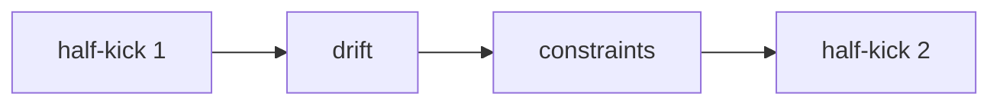
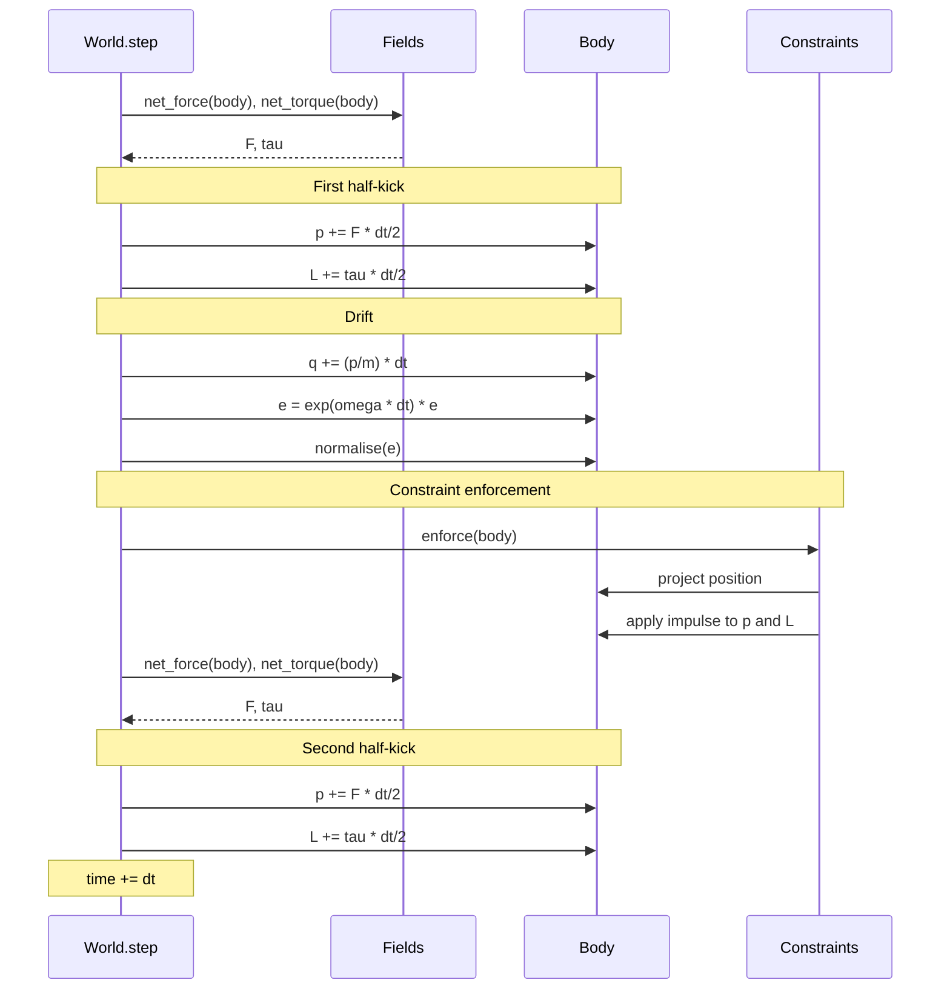

# Integration Scheme

## Why symplectic?

Standard integrators (forward Euler, RK4) do not preserve the symplectic
2-form of Hamiltonian phase space.  Over long simulations they
introduce artificial energy drift: Euler drifts upward, RK4 drifts
slowly downward.

Symplectic integrators preserve phase-space volume exactly.
They do not conserve $H$ exactly, but the error is bounded and oscillatory
rather than secular.  This is critical for long-term stability.

## The Leapfrog (Störmer-Verlet) scheme

Leapfrog is a second-order, time-reversible, symplectic integrator.
It splits each timestep into three stages:

```
half-kick   →   drift   →   half-kick
```

### Translational part

$$
\vec{p}\!\left(t + \frac{dt}{2}\right) = \vec{p}(t) + \vec{F}(\vec{q}(t)) \cdot \frac{dt}{2}
$$

$$
\vec{q}(t + dt) = \vec{q}(t) + \frac{\vec{p}\!\left(t + \frac{dt}{2}\right)}{m} \cdot dt
$$

$$
\vec{p}(t + dt) = \vec{p}\!\left(t + \frac{dt}{2}\right) + \vec{F}(\vec{q}(t + dt)) \cdot \frac{dt}{2}
$$

### Rotational part

Angular momentum half-kick (body frame):

$$
\vec{L}\!\left(t + \frac{dt}{2}\right) = \vec{L}(t) + \vec{\tau} \cdot \frac{dt}{2}
$$

Orientation drift via the quaternion exponential map:

$$
\vec{\omega} = I^{-1} \, \vec{L}\!\left(t + \frac{dt}{2}\right)
$$

$$
\theta = |\vec{\omega}| \cdot dt
$$

$$
\Delta e = \left(\cos\frac{\theta}{2}, \; \sin\frac{\theta}{2} \; \hat{\omega}\right)
$$

$$
\vec{e}(t + dt) = \Delta e \otimes \vec{e}(t)
$$

followed by normalisation to stay on the unit sphere.

Second angular half-kick:

$$
\vec{L}(t + dt) = \vec{L}\!\left(t + \frac{dt}{2}\right) + \vec{\tau} \cdot \frac{dt}{2}
$$

## Quaternion exponential map

Given a body-frame angular velocity $\vec{\omega}$ and a timestep $dt$:

1. Compute the rotation angle $\theta = |\vec{\omega}| \cdot dt$.
2. If $\theta \approx 0$, return the identity quaternion $(1, 0, 0, 0)$.
3. Otherwise, the rotation axis is $\hat{\omega} = \vec{\omega} / |\vec{\omega}|$.
4. The quaternion is $\left(\cos\frac{\theta}{2}, \; \sin\frac{\theta}{2} \; \hat{\omega}\right)$.

This is implemented in `lab/core/quaternion.py::exp_map(omega, dt)`.

## Constraint ordering

Constraints **must** be enforced between the drift and the second half-kick.



If constraints are applied *before* the drift, the position update can
immediately re-violate them.

If constraints are applied *after* the second half-kick, the momentum
has already been updated with forces computed at a potentially
non-physical position.

The correct placement ensures that:
1. After the drift, position may temporarily violate constraints.
2. The constraint projects position back and adjusts momentum.
3. The second half-kick uses forces evaluated at the corrected position.

This was verified experimentally during development of the original
bootstrap engine: incorrect ordering caused visible energy injection.

## Full rigid-body timestep — sequence diagram


