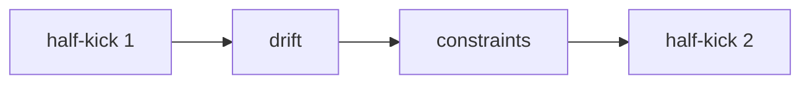
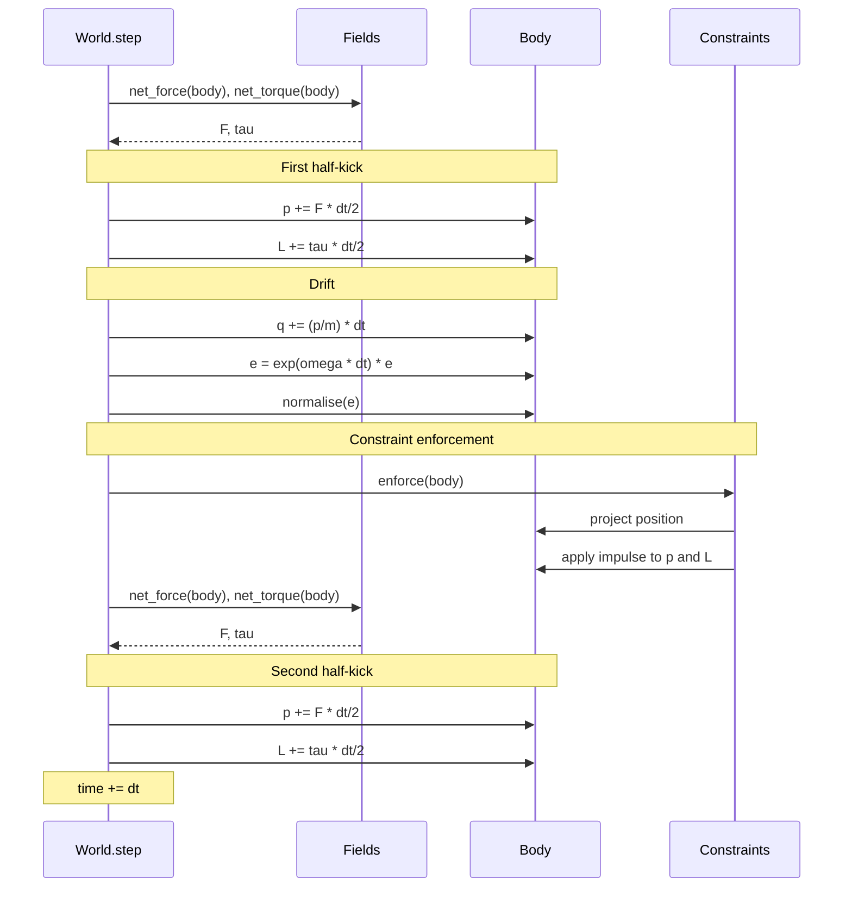

# Integration Scheme

## Why symplectic?

Standard integrators (forward Euler, RK4) do not preserve the symplectic
2-form of Hamiltonian phase space.  Over long simulations they
introduce artificial energy drift: Euler drifts upward, RK4 drifts
slowly downward.

Symplectic integrators preserve phase-space volume exactly.
They do not conserve $H$ exactly, but the error is bounded and oscillatory
rather than secular.  This is critical for long-term stability.

## The Leapfrog (Störmer-Verlet) scheme

Leapfrog is a second-order, time-reversible, symplectic integrator.
It splits each timestep into three stages:

```
half-kick   →   drift   →   half-kick
```

### Translational part

$$
\vec{p}\!\left(t + \frac{dt}{2}\right) = \vec{p}(t) + \vec{F}(\vec{q}(t)) \cdot \frac{dt}{2}
$$

$$
\vec{q}(t + dt) = \vec{q}(t) + \frac{\vec{p}\!\left(t + \frac{dt}{2}\right)}{m} \cdot dt
$$

$$
\vec{p}(t + dt) = \vec{p}\!\left(t + \frac{dt}{2}\right) + \vec{F}(\vec{q}(t + dt)) \cdot \frac{dt}{2}
$$

### Rotational part

Angular momentum half-kick (body frame):

$$
\vec{L}\!\left(t + \frac{dt}{2}\right) = \vec{L}(t) + \vec{\tau} \cdot \frac{dt}{2}
$$

Orientation drift via the quaternion exponential map:

$$
\vec{\omega} = I^{-1} \, \vec{L}\!\left(t + \frac{dt}{2}\right)
$$

$$
\theta = |\vec{\omega}| \cdot dt
$$

$$
\Delta e = \left(\cos\frac{\theta}{2}, \; \sin\frac{\theta}{2} \; \hat{\omega}\right)
$$

$$
\vec{e}(t + dt) = \Delta e \otimes \vec{e}(t)
$$

followed by normalisation to stay on the unit sphere.

### Lie-group structure and symplecticity

The orientation of a rigid body lives on $SO(3)$, the rotation group, which
is a Lie group — not a vector space.  The quaternion representation maps
$SO(3)$ to its double cover $SU(2) \cong S^3$ (the 3-sphere).  The
exponential map $\vec{\omega}\,dt \to \exp(\vec{\omega}\,dt/2)$ is the
Lie-group exponential; it maps the Lie algebra (angular velocities) to the
group (rotations).

The leapfrog scheme for rotations — half-kick $\vec{L}$, drift $\vec{e}$
via exp-map, half-kick $\vec{L}$ — is symplectic on $T^*SO(3)$ in the same
sense as the translational part: it is a composition of exact flows of split
Hamiltonians.  The exp-map drift is the exact flow of the free-rotor
Hamiltonian $H_{\text{rot}} = \vec{L}^T I^{-1} \vec{L} / 2$ for the
half-stepped angular momentum.  The half-kicks are exact flows of the torque
potential.

This structure preservation holds despite the nonlinearity of the exp-map.
The key is that the composition of shear maps on $T^*SO(3)$ preserves the
canonical symplectic form, just as the translational shear maps preserve
$d\vec{q} \wedge d\vec{p}$.  The quaternion normalisation after each step
(dividing by $\|\vec{e}\|$) projects back onto $S^3$ without breaking the
symplectic structure — it is the analogue of constraining a particle to a
surface.

Second angular half-kick:

$$
\vec{L}(t + dt) = \vec{L}\!\left(t + \frac{dt}{2}\right) + \vec{\tau} \cdot \frac{dt}{2}
$$

## Quaternion exponential map

Given a body-frame angular velocity $\vec{\omega}$ and a timestep $dt$:

1. Compute the rotation angle $\theta = |\vec{\omega}| \cdot dt$.
2. If $\theta \approx 0$, return the identity quaternion $(1, 0, 0, 0)$.
3. Otherwise, the rotation axis is $\hat{\omega} = \vec{\omega} / |\vec{\omega}|$.
4. The quaternion is $\left(\cos\frac{\theta}{2}, \; \sin\frac{\theta}{2} \; \hat{\omega}\right)$.

This is implemented in `lab/core/quaternion.py::exp_map(omega, dt)`.

## Constraint ordering

Constraints **must** be enforced between the drift and the second half-kick.



If constraints are applied *before* the drift, the position update can
immediately re-violate them.

If constraints are applied *after* the second half-kick, the momentum
has already been updated with forces computed at a potentially
non-physical position.

The correct placement ensures that:
1. After the drift, position may temporarily violate constraints.
2. The constraint projects position back and adjusts momentum.
3. The second half-kick uses forces evaluated at the corrected position.

This was verified experimentally during development of the original
bootstrap engine: incorrect ordering caused visible energy injection.

## Full rigid-body timestep — sequence diagram



---

## Timestep selection for rigid bodies

The leapfrog stability criterion $\omega\,dt \le 2$ applies to the fastest
angular frequency in the system.  For a free-falling rigid body striking a
floor, the worst-case angular velocity comes from an edge impact:

$$
\omega_{\max} \approx \frac{4v}{r}
$$

where $v = \sqrt{2gh}$ is the impact velocity and $r$ is the body's
characteristic radius (see [realistic_parameters.md](realistic_parameters.md)
for the derivation).  For a US quarter ($r = 0.01213\;\text{m}$) dropped from
$h = 2\;\text{m}$: $v \approx 6.3\;\text{m/s}$,
$\omega_{\max} \approx 2064\;\text{rad/s}$.

A useful heuristic: the rotation per step should not exceed ~30°
(0.5 rad):

| $dt$ (s) | $\omega\,dt$ (rad) | degrees/step | Verdict |
|-----------|---------------------|--------------|---------|
| 0.001    | 2.06               | 118°         | Unstable for edge impacts |
| 0.0005   | 1.03               | 59°          | Marginal; adequate for most drops |
| 0.00025  | 0.52               | 30°          | Safe for all drops |

The framework defaults to $dt = 0.0005\;\text{s}$ as a compromise between
accuracy and runtime.  Halving $dt$ doubles the number of integration steps
(and runtime).  For parameter sweeps over thousands of drops, this cost is
significant.

---

## Local vs global error

When we say an integrator is "order $p$", we mean its **local truncation
error** — the error introduced in a single step — is $O(dt^{p+1})$.  The
extra power of $dt$ matters once we accumulate errors over an entire
simulation.

### Local truncation error

Consider advancing from $t_n$ to $t_n + dt$.  If $y(t)$ is the exact
solution, the local truncation error (LTE) is

$$
\text{LTE} = y(t_n + dt) - y_{n+1} = C \, dt^{p+1} + O(dt^{p+2})
$$

where $C$ depends on the method and the derivatives of $y$.

### Global error

A simulation of total time $T$ requires $N = T / dt$ steps.  Each step
contributes an error of order $dt^{p+1}$.  In the worst case, these errors
add coherently:

$$
E_{\text{global}} \sim N \times \text{LTE} = \frac{T}{dt} \cdot O(dt^{p+1}) = O(dt^p)
$$

The factor of $1/dt$ from the number of steps eats one power of $dt$,
so a method with local order $p+1$ has **global order** $p$.

### Concrete comparison: leapfrog vs RK4

| Method   | Order $p$ | LTE           | Global error ($dt = 0.01$) |
|----------|-----------|---------------|----------------------------|
| Leapfrog | 2         | $O(dt^3)$     | $O(dt^2) \approx 10^{-4}$  |
| RK4      | 4         | $O(dt^5)$     | $O(dt^4) \approx 10^{-8}$  |

RK4 is more accurate per step.  But accuracy is not everything — the
next section explains why leapfrog can still win over long times.

## The modified Hamiltonian

The deepest reason to prefer leapfrog for Hamiltonian systems is not
accuracy-per-step; it is the existence of a **shadow Hamiltonian**.

### Shadow Hamiltonian

Backward error analysis shows that a symplectic integrator with timestep
$dt$ does not conserve the true Hamiltonian $H$ exactly.  Instead, it
**exactly** conserves a nearby modified (or "shadow") Hamiltonian:

$$
\tilde{H} = H + c_2 \, dt^2 \, H_2 + c_4 \, dt^4 \, H_4 + \cdots
$$

where the correction terms $H_2, H_4, \ldots$ are computable functions
on phase space that depend on $H$ and its derivatives.  The series is
asymptotic (generally divergent), but for small $dt$ the first few terms
give an excellent approximation.

### Bounded, oscillatory energy error

Because the trajectory lies on a level set of $\tilde{H}$ rather than
$H$, the energy error at any time satisfies

$$
|H(t) - H(0)| = O(dt^2)
$$

and this error is **bounded and oscillatory** — it does not grow with
time.  The trajectory effectively wobbles around a true orbit on a
nearby energy surface.

### Contrast with non-symplectic methods

For a non-symplectic integrator like RK4, no shadow Hamiltonian exists.
The energy error is smaller at first ($O(dt^4)$ per step), but it
**drifts monotonically**.  After $N$ steps:

$$
\Delta H_{\text{RK4}} \sim N \cdot O(dt^5) = \frac{T}{dt} \cdot O(dt^5) = O(T \, dt^4)
$$

This grows linearly with simulation time $T$.

### Why this matters in practice

For a simulation running $10^6$ steps:

- **Leapfrog**: energy error stays $O(dt^2)$ throughout, oscillating
  around zero.  The error at step $10^6$ is the same order as at
  step $1$.
- **RK4**: energy drift is $\sim 10^6 \times O(dt^5)$ and increases
  steadily.  For long integrations this can push the system onto
  qualitatively wrong trajectories.

This is why every molecular-dynamics code, every orbital-mechanics
integrator, and our own `lab/core/integrators.py` defaults to
symplectic methods for Hamiltonian systems.

For the full derivation and implications of the modified Hamiltonian
theorem, see [numerical_methods.md](numerical_methods.md) Section 5.3.

## Stability analysis

Accuracy tells us how close the numerical solution is to the true one
when $dt$ is small.  **Stability** tells us whether the numerical
solution stays bounded at all.

### The test equation

The standard probe is the scalar ODE

$$
\frac{dy}{dt} = \lambda \, y, \qquad \lambda \in \mathbb{C}
$$

with exact solution $y(t) = e^{\lambda t} \, y(0)$.  Applying an
integrator to this equation reduces each step to multiplication by an
**amplification factor** $g(\lambda \, dt)$.  The method is stable when
$|g| \le 1$.

### Forward Euler

One step of forward Euler gives

$$
y_{n+1} = (1 + \lambda \, dt) \, y_n
$$

so the amplification factor is $g = 1 + z$ where $z = \lambda \, dt$.
The stability region is

$$
|1 + z| \le 1
$$

which is a disk of radius 1 centred at $z = -1$ in the complex plane.
This is a small region — purely imaginary $\lambda$ (oscillatory
problems) lies on the imaginary axis, which is *outside* the disk.
Forward Euler is **unstable for undamped oscillators**.

### RK4

The amplification factor is the truncated exponential:

$$
g(z) = 1 + z + \frac{z^2}{2} + \frac{z^3}{6} + \frac{z^4}{24}
$$

The stability region $|g(z)| \le 1$ is much larger and extends slightly
along the imaginary axis (roughly $|z_{\text{imag}}| \le 2\sqrt{2}$).
RK4 can handle mildly oscillatory problems, but eventually the imaginary
axis leaves the stability region.

### Leapfrog and the harmonic oscillator

For the harmonic oscillator $\ddot{x} = -\omega^2 x$, the leapfrog
amplification matrix has eigenvalues on the **unit circle** as long as

$$
\omega \, dt \le 2
$$

On the unit circle $|g| = 1$ exactly — no amplification, no damping.
This is the hallmark of a symplectic method: the numerical flow preserves
area in phase space.  Beyond $\omega \, dt = 2$ the eigenvalues leave
the unit circle and the scheme blows up.

### CFL condition for wave equations

When solving the wave equation $\partial_{tt} u = c^2 \, \nabla^2 u$
on a spatial grid with spacing $\Delta x$, the highest resolvable
frequency is $\omega_{\max} = 2c / \Delta x$.  Applying the leapfrog
stability criterion $\omega_{\max} \, dt \le 2$ yields the
**Courant–Friedrichs–Lewy (CFL) condition**:

$$
\frac{c \, dt}{\Delta x} \le 1
$$

In $d$ dimensions this generalises to

$$
c \, dt \le \frac{\Delta x}{\sqrt{d}}
$$

Our FDTD electromagnetic-wave solver enforces this automatically — see
`lab/systems/emwave.py`, which computes and prints the Courant number
at initialisation and raises an error if the condition is violated.

## Adaptive step control

Fixed-timestep methods waste work in smooth regions and risk inaccuracy
in regions of rapid variation.  Adaptive methods adjust $dt$ on the fly
to keep the local error near a user-specified tolerance.

### The embedded RK45 pair

The Dormand–Prince method (the standard "RK45") embeds a 4th-order and
a 5th-order Runge–Kutta method that share the same intermediate stages.
At each step we compute:

- $y_{n+1}^{(4)}$ — the 4th-order estimate
- $y_{n+1}^{(5)}$ — the 5th-order estimate

The cost is six function evaluations per step (with FSAL — "first same
as last" — reuse from the previous step).

### Error estimate

The difference between the two estimates gives a cheap approximation to
the local truncation error of the 4th-order method:

$$
\text{err} = \| y^{(4)}_{n+1} - y^{(5)}_{n+1} \|
$$

This costs nothing beyond the stages we already computed.

### Step-size controller

Given a tolerance $\varepsilon$ and the current error estimate, the new
step size is

$$
dt_{\text{new}} = S \cdot dt_{\text{old}} \cdot \left( \frac{\varepsilon}{\text{err}} \right)^{1/(p+1)}
$$

where $p = 4$ is the order of the lower method and $S \approx 0.9$ is a
**safety factor** that prevents the controller from being too aggressive.

The controller logic:

1. **Accept** the step if $\text{err} \le \varepsilon$.  Advance $t$
   and optionally grow $dt$.
2. **Reject** the step if $\text{err} > \varepsilon$.  Shrink $dt$ and
   redo the step from $t_n$.

Additional safeguards prevent extreme changes:

$$
0.2 \le \frac{dt_{\text{new}}}{dt_{\text{old}}} \le 5.0
$$

This **min/max clamp** prevents the step size from collapsing or
exploding in a single adjustment.

### When to use adaptive stepping

Adaptive methods are ideal for problems where the timescale varies —
close encounters in $N$-body gravity, stiff chemical kinetics, or
chaotic flows near separatrices.  They are **not** symplectic, so they
should not replace leapfrog for long-horizon Hamiltonian problems unless
energy conservation is unimportant.

Our implementation lives in `lab/core/integrators.py::rk45_adaptive`.
It follows the Dormand–Prince tableau and the step controller described
above.

## The half-kick artefact and settle detection

When leapfrog is combined with a hard constraint (the floor), an operator-
splitting subtlety arises that affects settle detection.

### The problem

Consider a rigid body that has come to rest on the floor.  The leapfrog
step proceeds as:

1. **First half-kick**: $p_y \leftarrow p_y - mg \cdot dt/2$.  The body
   acquires downward momentum $\Delta p = -mg \cdot dt/2 \approx -1.39 \times 10^{-5}\;\text{kg\!\cdot\!m/s}$.
2. **Drift**: the body moves downward, penetrating the floor.
3. **Floor constraint**: detects penetration, lifts the body, applies an
   impulse.  If the energy is low enough, the constraint zeros all
   momenta ($p = 0$, $L = 0$).
4. **Second half-kick**: $p_y \leftarrow p_y - mg \cdot dt/2$.  The body
   again acquires $\Delta p \approx -1.39 \times 10^{-5}\;\text{kg\!\cdot\!m/s}$.

After step 4, the momentum is **never zero** — even though the floor
constraint just zeroed it.  The residual kinetic energy is

$$
KE_{\text{residual}} = \frac{(mg \cdot dt/2)^2}{2m}
= \frac{m g^2 dt^2}{8}
\approx 1.71 \times 10^{-8}\;\text{J}
$$

for $m = 0.00567\;\text{kg}$ (US quarter coin), $g = 9.81\;\text{m/s}^2$,
$dt = 0.0005\;\text{s}$.
This is a pure artefact of the operator splitting — the body is physically
at rest, but the integrator's half-kick injects a small momentum quantum
every step that the constraint then removes, only for the second half-kick
to reinject it.

### Why this blocks settle detection

The settle condition checks $KE < \epsilon$ for some threshold $\epsilon$.
If $\epsilon < KE_{\text{residual}}$, the body **never** settles, even
though it is visually at rest.

### Dimensionally-scaled settle threshold

A fixed threshold does not generalise across different masses and geometries.
Instead, scale the threshold to the body's gravitational potential energy at
its own characteristic height:

$$
\text{ke\_thr} = m \cdot g \cdot \text{settle\_h} \times 10^{-4}
$$

where $\text{settle\_h}$ is the shape's characteristic size (e.g. its radius).
For a coin ($\text{settle\_h} \approx \text{COIN\_RADIUS} = 0.01213\;\text{m}$):

$$
\text{ke\_thr} = 0.00567 \times 9.81 \times 0.01213 \times 10^{-4}
\approx 6.7 \times 10^{-8}\;\text{J}
$$

This is comfortably above the half-kick residual $1.7 \times 10^{-8}\;\text{J}$,
so the settle condition triggers reliably once the body is physically at rest.
See [realistic_parameters.md](realistic_parameters.md) for the derivation of
COIN_RADIUS, mass, and other physical constants used here.

### The fix: check between constraint and second half-kick

The solution is to place the settle check **between steps 3 and 4** — after
the constraint has zeroed the momentum but before the second half-kick
reinjects it:

```
half-kick 1 → drift → quaternion drift → constraint → SETTLE CHECK → half-kick 2
```

At this point, if the constraint zeroed all momenta, $KE = 0$ exactly, and
the settle condition triggers reliably.

This is implemented in `lab/core/rigid_body_jit.py::step_bodies`:

```python
# Floor constraint (may zero all momenta)
(pos, mom, ori, amom) = _floor(...)

# Settle detection — BEFORE second half-kick
ke = translational_ke + rotational_ke
if ke < threshold and pos_y < settle_h:
    sc[k] += 1
    if sc[k] > 100:
        alive[k] = False

# Second half-kick
mom[k, 1] -= mass * g * half_dt
```

### General principle

When combining symplectic integrators with non-conservative operators
(constraints, damping, dissipation), the **placement** of the non-
conservative step within the splitting matters.  Observables should be
sampled at the point in the cycle where the state is most physically
meaningful — typically after the constraint has been enforced but before
the next kick contaminates the state.

This is a specific instance of a more general issue in **operator splitting**:
the intermediate states between split operators are not all equally physical.
The half-kick state has position and momentum "staggered" in time by $dt/2$;
the post-constraint state is the most self-consistent snapshot.
