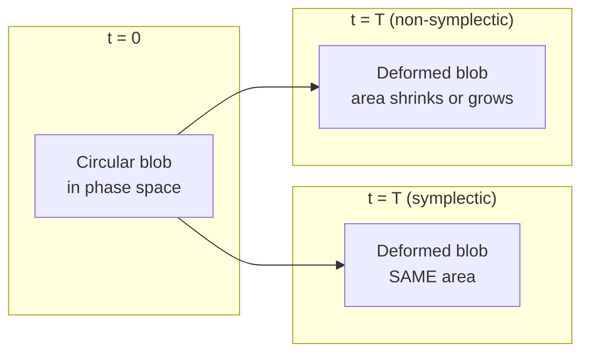

# Numerical Methods

This document covers the core numerical ideas that underpin every simulation in
the lab framework. The goal is *working fluency*: after reading each section
you should be able to predict, diagnose, and fix the most common numerical
pathologies you will encounter in your experiments.

---

## 1. Floating-Point Arithmetic

### 1.1 IEEE 754 representation

Every `float64` value is stored as a 64-bit word:

```
 [sign 1 bit] [exponent 11 bits] [mantissa 52 bits]
```

The value it represents is

$$
(-1)^{s} \times 1.m_{51}m_{50}\ldots m_{0} \times 2^{e - 1023}
$$

where $s$ is the sign bit, $e$ is the biased exponent, and $m_i$ are the
mantissa bits. The leading "1." is implicit, so 52 stored bits give 53
effective bits of significand.

Key consequences:

* **Finite precision.** The relative gap between adjacent representable
  numbers near 1.0 is *machine epsilon*:

$$
\epsilon_{\text{mach}} = 2^{-52} \approx 2.22 \times 10^{-16}
$$

* **Non-uniform spacing.** The gap doubles every time the exponent increments.

* **Representation error.** Decimal fractions like 0.1 have no exact binary
  form, which is why the classic test fails:

```python
>>> 0.1 + 0.2 == 0.3
False
>>> 0.1 + 0.2
0.30000000000000004
```

The lesson: **never compare floating-point values with `==`**. Use a
tolerance-based comparison instead.

### 1.2 Catastrophic cancellation

When you subtract two nearly-equal numbers, leading significant digits cancel
and the result is dominated by low-order noise. Consider
$f(x) = \sqrt{x+1} - \sqrt{x}$ for large $x$:

$$
\sqrt{x+1} - \sqrt{x} = \frac{1}{\sqrt{x+1} + \sqrt{x}} \approx \frac{1}{2\sqrt{x}}
$$

The left-hand form loses precision; the right-hand form is algebraically
equivalent but numerically stable. If two values agree to $k$ digits, their
difference retains only about $16 - k$ significant digits in `float64`.

### 1.3 Where this matters in our code

**Quaternion normalization** (`lab/core/quaternion.py`). After repeated
multiplication, quaternions drift off the unit sphere. The `normalize`
function guards against zero norm with a threshold of `1e-15` --- chosen to
sit well above machine epsilon but far below any physical quaternion magnitude:

```python
def normalize(q):
    n = np.linalg.norm(q)
    if n < 1e-15:
        return np.array([1.0, 0.0, 0.0, 0.0])
    return q / n
```

The same threshold appears in `from_axis_angle` and `exp_map`.

**Contact detection** (`lab/systems/rigid_body/constraints.py`). The floor
constraint uses several small thresholds:

| Threshold | Value | Purpose |
|-----------|-------|---------|
| `penetration < 0` | 0 m | Body below floor? |
| `excess < 2 * char_size` | ~0.024 m (coin), ~0.016 m (cube) | Near-floor damping zone |
| `abs(v_n) > 0.1` | 0.1 m/s | Impact velocity large enough for restitution? |
| `v_t_mag > 1e-12` | 1e-12 m/s | Meaningful tangential sliding? |
| `ke < 0.01 * ke_scale` | ~6.7e-7 J (coin) | Hard zero-momentum snap |
| `ke < 0.5 * ke_scale` | ~3.4e-5 J (coin) | Multiplicative damping zone |
| `ke_thr = m*g*L*1e-4` | ~6.7e-8 J (coin) | Settle detection threshold |

Where ke_scale = m * g * char_size (see realistic_parameters.md).

All KE thresholds scale with `ke_scale = m * g * L` — the potential energy of lifting the object by its own characteristic size. See [realistic_parameters.md](realistic_parameters.md) for derivations.

Each is set just above the level where floating-point noise would produce
spurious behavior (ghost impulses, jittering contacts, perpetual micro-bouncing).

**Energy conservation** (`lab/analysis/energy.py`). When `conservation_error`
computes $\Delta E / E_0$, division amplifies noise if $E_0$ is small. A
relative error of $10^{-14}$ should be treated as "zero drift."

---

## 2. Finite Differences

### 2.1 Derivation from Taylor series

Expand $f(x \pm h)$ around $x$:

$$
f(x + h) = f(x) + h f'(x) + \frac{h^2}{2} f''(x)
           + \frac{h^3}{6} f'''(x) + \mathcal{O}(h^4)
$$

$$
f(x - h) = f(x) - h f'(x) + \frac{h^2}{2} f''(x)
           - \frac{h^3}{6} f'''(x) + \mathcal{O}(h^4)
$$

Three approximations for $f'(x)$:

**Forward difference:** $\displaystyle f'(x) \approx \frac{f(x+h) - f(x)}{h}, \qquad \text{error} = \mathcal{O}(h)$

**Backward difference:** $\displaystyle f'(x) \approx \frac{f(x) - f(x-h)}{h}, \qquad \text{error} = \mathcal{O}(h)$

**Central difference** (subtract the two expansions):

$$
f'(x) \approx \frac{f(x+h) - f(x-h)}{2h}, \qquad \text{error} = \mathcal{O}(h^2)
$$

The central difference gains an order because even-powered error terms cancel.

### 2.2 Implementation in the framework

`lab/core/hamiltonian.py` computes $\partial H / \partial q_i$ via central
differences when no analytical gradient is supplied:

```python
def _numerical_grad_q(self, q, p, eps):
    grad = np.zeros_like(q)
    for i in range(len(q)):
        qp, qm = q.copy(), q.copy()
        qp[i] += eps
        qm[i] -= eps
        grad[i] = (self.H(qp, p) - self.H(qm, p)) / (2 * eps)
    return grad
```

Each component is perturbed independently with `+eps` and `-eps`. The same
pattern is used for `_numerical_grad_p`. Default step size: `eps = 1e-8`.

### 2.3 Truncation error vs. round-off error

Two competing errors determine finite-difference quality:

1. **Truncation error** --- dropped Taylor terms: $\sim \frac{h^2}{6}|f'''|$.
   Shrinks as $h \to 0$.

2. **Round-off error** --- when $h$ is tiny, $f(x+h) \approx f(x-h)$ and
   catastrophic cancellation amplifies rounding noise: $\sim \epsilon_{\text{mach}} |f| / h$.

Total error:

$$
E(h) \approx \underbrace{\frac{h^2}{6}|f'''|}_{\text{truncation}}
     + \underbrace{\frac{\epsilon_{\text{mach}}\,|f|}{h}}_{\text{round-off}}
$$

Minimize by setting $dE/dh = 0$:

$$
h^* \sim \left(\frac{3\,\epsilon_{\text{mach}}\,|f|}{|f'''|}\right)^{1/3}
\sim (10^{-16})^{1/3} \approx 5 \times 10^{-6}
$$

The default `eps = 1e-8` is close to this optimum and works well for all
Hamiltonians in the catalog.

```
log |error|
    |
    |\
    | \  truncation O(h^2)
    |  \
    |   \_____
    |         \_____ total
    |    optimal h*  \
    |                 \
    |         round-off O(eps/h)
    +----------------------------> log h
```

### 2.4 Second derivatives

For the spatial Laplacian in wave equations, the standard central stencil is:

$$
f''(x) \approx \frac{f(x+h) - 2f(x) + f(x-h)}{h^2}, \qquad \text{error} = \mathcal{O}(h^2)
$$

This is the spatial discretization used in the FDTD solver (`lab/systems/emwave.py`).

---

## 3. Convergence Order

### 3.1 Definitions

An integrator has **order $p$** if:

* **Local (one-step) error:**

$$
\|\mathbf{y}_1 - \mathbf{y}(t_0 + \Delta t)\| = \mathcal{O}(\Delta t^{p+1})
$$

* **Global error** (after $N = T / \Delta t$ steps):

$$
\|\mathbf{y}_N - \mathbf{y}(T)\| = \mathcal{O}(\Delta t^{p})
$$

Global error is one order lower because $N \propto 1/\Delta t$ one-step
errors accumulate.

### 3.2 Integrators in this framework

| Integrator | Order $p$ | Symplectic? | File |
|------------|-----------|-------------|------|
| Leapfrog (Störmer-Verlet) | 2 | Yes | `lab/core/integrators.py` |
| RK4 | 4 | No | `lab/core/integrators.py` |
| RK45 adaptive | 4--5 | No | `lab/core/integrators.py` |

### 3.3 Empirical verification

Run the same problem at two step sizes and measure the error. If the
integrator is order $p$, halving $\Delta t$ reduces the error by $2^p$:

1. Integrate to time $T$ with step $\Delta t$; measure endpoint error $E(\Delta t)$.
2. Repeat with $\Delta t / 2$; measure $E(\Delta t / 2)$.
3. Compute the observed order:

$$
p = \log_2\!\left(\frac{E(\Delta t)}{E(\Delta t / 2)}\right)
$$

Expect $p \approx 2$ for leapfrog and $p \approx 4$ for RK4.

```python
from lab.core.integrators import leapfrog, rk4
from lab.systems.oscillators import harmonic_oscillator

H = harmonic_oscillator(k=1.0, m=1.0)

def endpoint_error(integrator, dt, T=10.0):
    state = State(q=[1.0], p=[0.0])
    for _ in range(int(T / dt)):
        state = integrator(H, state, dt)
    return abs(state.q[0] - np.cos(T))

e1 = endpoint_error(leapfrog, dt=0.01)
e2 = endpoint_error(leapfrog, dt=0.005)
print(f"Leapfrog order: {np.log2(e1/e2):.2f}")  # expect ~2.0
```

### 3.4 Richardson extrapolation

Given estimates $y_h$ and $y_{h/2}$ from step sizes $h$ and $h/2$ with an
order-$p$ method:

$$
y_{\text{extrap}} = \frac{2^p \, y_{h/2} - y_h}{2^p - 1}
$$

This eliminates the leading error term, yielding $\mathcal{O}(h^{p+1})$
accuracy. The `rk45_adaptive` integrator uses the Dormand-Prince embedded pair described in Section 7 of `integration.md`: the 4th-order and 5th-order estimates share six function evaluations, and their difference provides the local error estimate at no additional cost.

### 3.5 Order is not everything

* **Cost per step.** RK4 evaluates the gradient four times; leapfrog needs
  only two (the half-kicks share evaluations when steps are chained). Leapfrog
  at $\Delta t / 2$ costs the same as one RK4 step but gives $4\times$ error
  reduction.

* **Structure preservation.** Over millions of steps, geometric properties
  (symplecticity, time-reversibility) matter more than per-step accuracy.

---

## 4. Numerical Stability

An integrator can have high-order accuracy and still *blow up* if the timestep
exceeds the system's natural timescales.

### 4.1 Linear stability analysis

For the test equation $\dot{y} = \lambda y$ with $\text{Re}(\lambda) \le 0$,
**forward Euler** gives amplification factor $g = 1 + \lambda \Delta t$.
Stability requires $|g| \le 1$, restricting $\lambda \Delta t$ to a disk of
radius 1 centered at $-1$ in the complex plane. For purely oscillatory systems
($\lambda = i\omega$), the imaginary axis lies *outside* this disk --- forward
Euler is unconditionally unstable for Hamiltonian systems.

For **leapfrog** on the harmonic oscillator $\ddot{q} = -\omega^2 q$:

$$
\omega \, \Delta t \le 2
$$

The timestep must resolve the fastest oscillation period.

### 4.2 Conditional vs. unconditional stability

* **Conditionally stable** (leapfrog, RK4): stable only below a problem-dependent
  $\Delta t$ threshold. All integrators in `lab/core/integrators.py` are in
  this category.

* **Unconditionally stable** (implicit Euler, trapezoidal rule): stable for
  any $\Delta t$, but require solving an implicit equation each step.

### 4.3 The CFL condition for FDTD

The electromagnetic solver in `lab/systems/emwave.py` is subject to the
**Courant-Friedrichs-Lewy (CFL)** condition. For the 1D wave equation:

$$
C = \frac{c \, \Delta t}{\Delta x} \le 1
$$

where $C$ is the **Courant number**. If $C > 1$, the numerical domain of
dependence is narrower than the physical domain of dependence, and errors
grow exponentially.

In 2D with spacings $\Delta x$ and $\Delta y$:

$$
c \, \Delta t \le \frac{1}{\sqrt{\dfrac{1}{\Delta x^2} + \dfrac{1}{\Delta y^2}}}
$$

The framework enforces these automatically. In `FDTDGrid1D`:

```python
self.dt = dt if dt is not None else 0.5 * dx / c  # Courant number = 0.5
```

In `FDTDGrid2D`:

```python
self.dt = dt if dt is not None else 0.5 / (c * np.sqrt(1/dx**2 + 1/dy**2))
```

Both default to Courant number 0.5, providing a safety margin below the limit.

### 4.4 What CFL violation looks like

```
  Stable (C = 0.5)              Unstable (C = 1.5)

  |    /\                        |     /\/\/\
  |   /  \     /\                |    /      \/\/\
  |  /    \   /  \               |   /            \/\/\  (grows!)
  | /      \_/    \              |  /
  |/               \___          | /
  +--------------------> x       +--------------------> x
```

With $C < 1$ the pulse propagates cleanly. Above 1, amplitude grows without
bound within a few dozen steps.

---

## 5. Symplectic Structure Preservation

This is the deepest idea in the framework and the reason `leapfrog` is the
default for all Hamiltonian systems, despite RK4 having higher order.

### 5.1 Phase-space geometry

A Hamiltonian system with $n$ degrees of freedom lives in $2n$-dimensional
phase space $(\mathbf{q}, \mathbf{p})$. Hamilton's equations

$$
\dot{q}_i = \frac{\partial H}{\partial p_i}, \qquad
\dot{p}_i = -\frac{\partial H}{\partial q_i}
$$

define a flow that preserves the **symplectic 2-form**
$\omega = \sum_i dq_i \wedge dp_i$. In physical terms: any region in phase
space preserves its "area" as it evolves (**Liouville's theorem**).

### 5.2 Symplectic integrators

An integrator is *symplectic* if its one-step map preserves $\omega$ exactly.
Leapfrog achieves this through a composition of shear maps:

```
Kick:   (q, p) -> (q,            p - dH/dq * dt/2)   [shear in p]
Drift:  (q, p) -> (q + dH/dp*dt, p)                   [shear in q]
Kick:   (q, p) -> (q,            p - dH/dq * dt/2)   [shear in p]
```

Each shear has a Jacobian with determinant 1 and the correct symplectic
structure; their composition is therefore symplectic.

### 5.3 The modified Hamiltonian theorem

The central theoretical result. A symplectic integrator of order $p$ does not
conserve $H$ exactly, but it *exactly conserves* a nearby **modified
Hamiltonian**:

$$
\tilde{H} = H + \Delta t^p \, H_{p+1} + \Delta t^{p+1} \, H_{p+2} + \cdots
$$

For leapfrog ($p = 2$), the leading correction is:

$$
\tilde{H} = H + \frac{\Delta t^2}{24}\Bigl[
    (\nabla_q H)^2 - (\nabla_p H)^T (\nabla_q \nabla_p H)(\nabla_p H)
\Bigr] + \mathcal{O}(\Delta t^4)
$$

Implications:

1. **Bounded energy error.** $H$ oscillates around its true value with
   amplitude $\mathcal{O}(\Delta t^p)$ *for all time*. No secular drift.

2. **Faithful orbits.** The numerical trajectory is an exact orbit of a
   nearby physical system. Poincare sections have the correct topology.

3. **Long-time fidelity.** After $10^9$ steps the leapfrog energy error is
   still $\mathcal{O}(\Delta t^2)$, while RK4 accumulates drift
   $\sim T \cdot \Delta t^4$ growing linearly with simulation time.

### 5.4 Energy behavior comparison

```
  Energy
  H(t)
    |
    |   Forward Euler (diverges upward)
    |  /
    | /    . . . . . . . . . . . . . . . . . . .  True H
    |/ ~ ~ ~ ~ ~ ~ ~ ~ ~ ~ ~ ~                    Leapfrog (bounded oscillation)
    |  \
    |   \
    |    \    RK4 (slow systematic drift downward)
    |     -------__________
    +----------------------------------------------> t
```

Leapfrog oscillates with amplitude $\propto \Delta t^2$ but never drifts.
RK4 has smaller per-step error but accumulates a secular trend. This is
directly observable via `lab/analysis/energy.py::conservation_error`.

### 5.5 Phase-space area preservation

Track a cloud of initial conditions in $(q, p)$. Under Hamiltonian flow the
enclosed area is conserved. A symplectic integrator preserves this; a
non-symplectic one does not.



The `lab/analysis/phase_space.py` and `lab/analysis/poincare.py` modules can
visualize this: plot a Poincare section with leapfrog and you get clean
invariant curves; switch to forward Euler and the curves smear into spirals.

### 5.6 Time-reversibility

Leapfrog is time-reversible: one step with $+\Delta t$ followed by one with
$-\Delta t$ returns exactly to the start (up to round-off). This symmetric
splitting means the modified Hamiltonian contains only even powers:

$$
\tilde{H} = H + c_2 \, \Delta t^2 + c_4 \, \Delta t^4 + \cdots
$$

### 5.7 When symplecticity is not enough

* **Dissipative systems.** Phase-space volume should contract, but a
  symplectic integrator forces it to stay constant. The rigid-body system
  handles this by applying dissipative impulses (friction, rolling resistance
  in `lab/systems/rigid_body/constraints.py`) *between* the symplectic kicks.

* **Driven systems** with time-dependent Hamiltonians --- the modified
  Hamiltonian theorem assumes $H$ is autonomous.

* **Chaotic systems at very long times.** Symplecticity preserves qualitative
  structure (Lyapunov exponents, KAM tori) but individual trajectories diverge
  exponentially regardless.

### 5.8 Quaternion normalisation drift

The unit quaternion constraint $\|q\| = 1$ is not exactly preserved by floating-point quaternion multiplication. Each multiplication introduces a relative error of order $\epsilon_{\text{mach}}$, so after $N$ steps:

$$\|q_N\| \approx 1 + N \cdot O(\epsilon_{\text{mach}})$$

For $N = 10^6$ steps, the drift is $\sim 10^{-10}$ — small but growing linearly. Without correction, the quaternion would drift off the unit sphere, causing the rotation matrix to become non-orthogonal and the contact-detection algorithm to produce incorrect results.

The codebase renormalises $q$ after every integration step. The cost is one norm computation and four divisions — negligible compared to force evaluation. This is analogous to projecting a constrained particle back onto its constraint surface after each step.

---

## Summary: Choosing Parameters for a New Experiment

| Parameter | How to choose | Where it appears |
|-----------|---------------|------------------|
| `dt` | Resolve fastest timescale; verify with convergence test | `Experiment.run(dt=...)` |
| `eps` (finite diff) | Default `1e-8` is near-optimal; rarely needs changing | `Hamiltonian.grad_q(eps=...)` |
| `dx`, `dy` (FDTD) | At least 10 points per shortest wavelength | `FDTDGrid1D(dx=...)` |
| CFL safety | Default 0.5; never exceed 1.0 | Automatic in `FDTDGrid1D.__init__` |
| Integrator | Leapfrog for long conservative runs; RK4 for short high-accuracy | `lab/core/integrators.py` |
| Tolerance | `1e-8` default; tighten for sensitive problems | `rk45_adaptive(tol=...)` |

When in doubt, run the same experiment at two step sizes and check that the
convergence ratio matches the expected order.

---

## 6. Damping Strategies and Settle Detection

Rigid-body simulations with floor constraints must eventually detect that an
object has come to rest. This is a numerical problem with several subtleties.

### 6.1 The energy-based rest condition

The conceptually cleanest approach: declare a body "settled" when its total
kinetic energy (translational + rotational) drops below a threshold $\epsilon$
and stays there for $N$ consecutive timesteps:

$$
KE = \frac{|\vec{p}|^2}{2m} + \frac{1}{2}\vec{L}^T I^{-1} \vec{L} < \epsilon
$$

The consecutive-step requirement prevents false positives at momentary
inflection points (e.g., the apex of a tiny bounce where $KE$ instantaneously
passes through zero).

### 6.2 Choosing thresholds

The thresholds interact with the integrator's operator-splitting artefact
(see [docs/integration.md](integration.md)):

| Threshold | Meaning | Typical value | Rationale |
|---|---|---|---|
| $\epsilon$ (settle KE) | Maximum kinetic energy to count as "at rest" | $10^{-4}$ J | Above the leapfrog half-kick residual $\sim 10^{-5}$ |
| $N$ (consecutive steps) | How many steps the body must stay below $\epsilon$ | 100–200 | Filters momentary dips; at $dt = 0.001$, this is 0.1–0.2 s |
| `settle_h` (height ceiling) | Maximum $y$-position for settle candidacy | Shape-dependent | Prevents detecting "settled" while still in free fall |
| `near_floor` (damping zone) | Penetration depth below which damping activates | 0.05 m | Must be wide enough to catch micro-bouncing bodies |

### 6.2.1 Why thresholds must scale with physical parameters

When the simulation uses realistic object dimensions (a 12 mm coin rather than a 0.15 m coin), all energy-based thresholds must be rescaled. A fixed threshold like $\epsilon = 10^{-6}$ J that works for a 1 kg, 0.3 m object will be orders of magnitude too large for a 5.67 g, 12 mm object.

The natural energy unit for contact physics is:

$$E_0 = m \, g \, L$$

where $L$ is the object's characteristic size (radius for a coin, half-side for a cube). This is the potential energy of lifting the object by one body-length — the minimal energy scale at which contact dynamics are physically meaningful.

For the US quarter: $E_0 = 0.00567 \times 9.81 \times 0.01213 \approx 6.7 \times 10^{-4}$ J.

All thresholds in the codebase are defined as fractions of $E_0$:

| Threshold | Fraction of $E_0$ | Rationale |
|-----------|-------------------|-----------|
| Settle KE | $10^{-4} \cdot m g h_{\text{settle}}$ | 0.01% of PE at settle height |
| Snap-to-zero KE | $0.01 \cdot E_0$ | 1% of one-body-length PE |
| Multiplicative damp zone | $0.5 \cdot E_0$ | 50% of one-body-length PE |

This dimensional scaling ensures that the settle detection works correctly regardless of the object's mass and size. See [realistic_parameters.md](realistic_parameters.md) for the full threshold table.

### 6.3 Damping near the floor

Without explicit damping, a body in contact with the floor can oscillate
indefinitely: the leapfrog scheme is symplectic and preserves energy, so
tiny bounces never decay.  Physical floors dissipate energy through
inelastic deformation, so we add three damping mechanisms:

**1. Velocity-dependent restitution.** The coefficient of restitution drops
from its nominal value to zero at low impact speeds:

$$
e_{\text{eff}} = \begin{cases} e_0 & |v_n| > 0.1\;\text{m/s} \\ 0 & |v_n| \le 0.1\;\text{m/s} \end{cases}
$$

This prevents the "infinite micro-bounce" where a body bounces with ever-
decreasing amplitude but never actually stops.

**2. Rolling resistance.** When the body is in the near-floor zone, angular
momentum is reduced by a multiplicative factor each timestep:

$$
\vec{L} \leftarrow (1 - r_{\text{eff}}) \, \vec{L}
$$

The effective resistance $r_{\text{eff}}$ scales with how close the body is
to its minimum resting height (a coin lying flat is more strongly damped than
one balanced on edge):

$$
r_{\text{eff}} = r_0 \cdot \max\!\Big(0,\; 1 - \frac{y - y_{\min}}{0.05}\Big)
$$

This is not a Coulomb friction model — it is a phenomenological damping
designed to produce convergence in finite time.

**3. Linear velocity damping.** A bulk $1\%$ per-step reduction in all
momentum components when the body is in the near-floor zone:

$$
\vec{p} \leftarrow 0.99 \, \vec{p}
$$

This handles the case where a body slides horizontally across the floor
with negligible angular motion — pure friction would require computing the
tangential force direction, which the simpler multiplicative damping avoids.

**4. Hard zero snap.** When the body is within a small tolerance of its
resting height *and* its total KE is below 0.1 J, all momenta are set
to exactly zero:

$$
\vec{p} = \vec{0}, \quad \vec{L} = \vec{0}
$$

This guarantees finite-time convergence.  Without it, the multiplicative
damping only approaches zero asymptotically ($0.99^n \to 0$ but never
reaches it).

### 6.4 Force-settle timeout

Some configurations — particularly rods balanced at critical tilt angles —
can enter quasi-periodic regimes where the body rocks back and forth,
alternating between the damping zone and free flight.  The multiplicative
damping only applies inside the zone, so the rocking never fully converges.

A pragmatic solution: if a body has spent more than 5000 cumulative
timesteps below `settle_h` (regardless of KE), declare it settled.  At
$dt = 0.0005$, 5000 steps correspond to 2.5 s of simulated time near the
floor — physically, any residual motion at that point is below any
measurable threshold.

This is implemented in `lab/core/rigid_body_jit.py::step_bodies` as a secondary
branch of the settle-detection logic.

---

## Further Reading

* Hairer, Lubich, Wanner. *Geometric Numerical Integration* (2006) --- the
  definitive reference on symplectic integrators.
* Goldstein, Poole, Safko. *Classical Mechanics*, 3rd ed. --- Hamiltonian
  formalism and phase-space geometry.
* Press et al. *Numerical Recipes*, 3rd ed. --- finite differences, ODE
  integration, floating-point pitfalls.
* Taflove, Hagness. *Computational Electrodynamics: The FDTD Method* ---
  CFL conditions, PML boundaries, Yee lattice.
