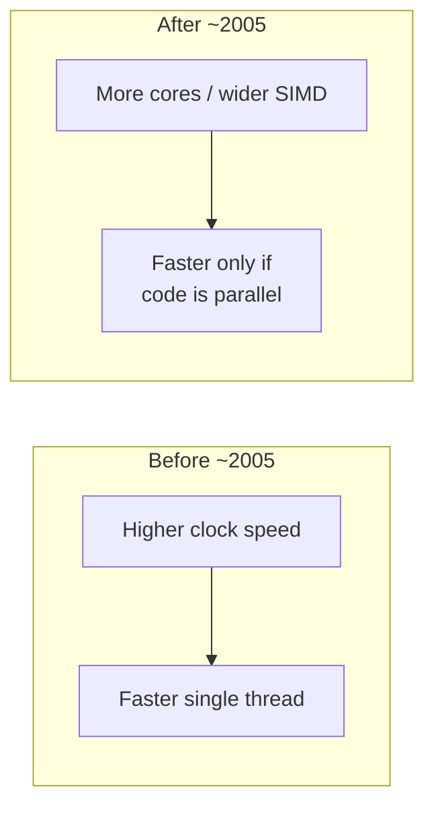
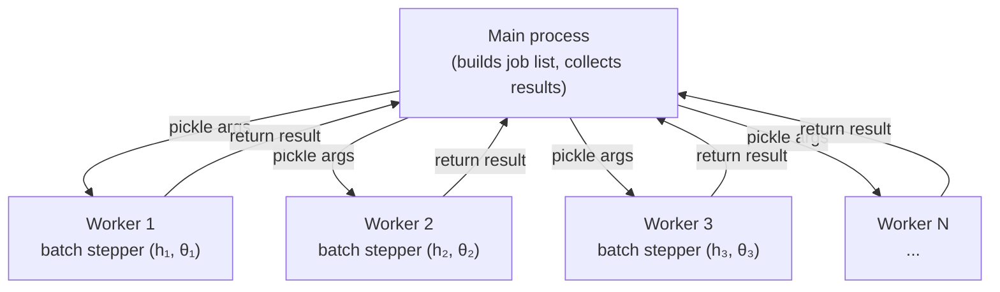
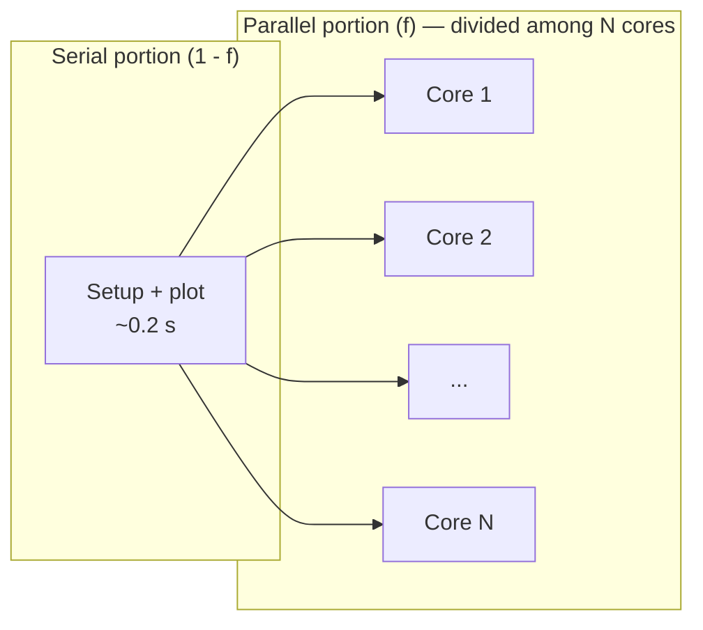

# Parallelism

## Why parallelism matters

For decades, software got faster for free. Each new generation of processors ran at a
higher clock frequency, so the same single-threaded code executed more operations per
second without changing a line. This era ended around 2005.

The cause is thermodynamic. Dynamic power dissipation in a CMOS chip scales as

$$
P \propto C \, V^2 \, f
$$

where $C$ is capacitance, $V$ is supply voltage, and $f$ is clock frequency. Raising $f$
requires raising $V$ (to maintain signal integrity at shorter switching times), so power
grows roughly as $f^3$. By the time desktop processors hit ~4 GHz, the heat density
approached the limit of air cooling. Intel's Pentium 4 Prescott (2004) illustrated this
wall vividly: its 3.8 GHz clock drew over 100 W in a package barely larger than a
postage stamp.

The semiconductor industry pivoted. Instead of faster cores, chips gained *more* cores.
A modern desktop CPU has 8--16 cores; a GPU has thousands of simpler ones. Moore's law
(transistor count doubling every ~2 years) continues, but those transistors now buy
parallelism rather than clock speed.

The consequence for scientific computing is stark: **if your code runs on a single core,
it will not get meaningfully faster on next year's hardware.** All future performance
gains come from using multiple execution units simultaneously.



Our parameter sweep in `lab/experiments/base.py` runs thousands of independent
rigid-body simulations. On a single core at 4 GHz, a 40x60 grid takes minutes. Spread
across 8 CPU cores it completes in roughly one-eighth the time. On a GPU with thousands
of threads it finishes orders of magnitude faster. The physics is identical — only the
mapping onto hardware changes.


## Processes vs threads

Operating systems offer two mechanisms for concurrent execution: **processes** and
**threads**.

| Property | Process | Thread |
|---|---|---|
| Address space | Own (isolated) | Shared with parent |
| Creation cost | Higher (fork/spawn) | Lower |
| Communication | IPC (pipes, shared mem) | Direct memory access |
| Fault isolation | Crash does not affect others | Crash kills entire process |

A thread is a lightweight execution context that shares heap memory with other threads
in the same process. This makes data exchange trivial but introduces **race conditions**:
two threads writing to the same memory location simultaneously can produce corrupted
results. Correct multithreaded programs require synchronisation primitives (locks,
barriers, atomics), which are notoriously difficult to reason about.

### Python's GIL

CPython (the standard Python interpreter) has a **Global Interpreter Lock (GIL)** — a
mutex that allows only one thread to execute Python bytecode at a time. This means
CPU-bound Python threads cannot run in parallel; they merely interleave. The GIL exists
to protect CPython's reference-counting garbage collector from race conditions, and
removing it has been a multi-decade engineering challenge (PEP 703 is making progress,
but free-threaded Python remains experimental).

The practical consequence: **for CPU-bound scientific workloads in Python, you must use
processes, not threads.** Each process has its own interpreter and its own GIL, so $N$
processes genuinely execute on $N$ cores.

This is exactly what our drop experiment does. In `lab/experiments/base.py`,
the `DropExperiment.sweep()` method distributes simulations across a `ProcessPoolExecutor`:

```python
with ProcessPoolExecutor(max_workers=workers) as executor:
    futures = {executor.submit(_worker, job): job for job in jobs}
    for future in as_completed(futures):
        i, j, result = future.result()
```

Each worker process receives a serialised (pickled) tuple of parameters, runs
the batch stepper in `lab/core/rigid_body_jit.py` for its (h, θ) pair, and returns the integer outcome. The main process collects
results as futures complete. There is no shared mutable state — the isolation of
processes eliminates race conditions entirely.



The `_worker` function is defined at module level (not as a nested function or lambda)
because Python's `pickle` module can only serialise top-level functions. This is a common
pattern when using `ProcessPoolExecutor`.

### Load balancing

`ProcessPoolExecutor.map` distributes tasks to workers in chunks. When used with
`concurrent.futures.as_completed`, results are returned as they finish — fast-settling
drops (low heights, flat angles) complete first and free their workers for slower ones
(high heights, near-edge angles). This implicit load balancing is effective because the
per-simulation runtime varies by an order of magnitude across the parameter grid.


## Embarrassingly parallel problems

A problem is **embarrassingly parallel** (also called "perfectly parallel" or
"pleasingly parallel") if it decomposes into tasks that require no inter-task
communication. Formally, let $\{T_1, T_2, \ldots, T_N\}$ be the set of tasks. The
problem is embarrassingly parallel if the output of $T_i$ depends only on its own input
and never on the intermediate state of any $T_j$ where $j \neq i$.

Our height-by-angle parameter sweep is the textbook example. Each cell $(h_i, \theta_j)$
in the grid runs a complete rigid-body simulation from initial conditions to rest. The
simulation at $(h_3, \theta_7)$ never needs to know anything about $(h_5, \theta_2)$.
There are no messages, no synchronisation points, no shared state. The tasks are
independent by construction.

This independence has profound practical consequences:

- **Linear speedup** is achievable in principle — doubling the number of processors
  halves the wall-clock time (minus overhead).
- **No deadlocks or race conditions** — there is nothing to lock.
- **Trivial load balancing** — hand each processor a roughly equal share of tasks.
- **Fault tolerance** — if one task fails, the others are unaffected.

Not all problems enjoy this structure. Consider two counterexamples from physics:

| Problem | Why it requires communication |
|---|---|
| **Fluid dynamics (CFD)** | Each cell's pressure update depends on neighbouring cells at the current timestep. Information propagates across the domain every step. |
| **N-body gravity** | Every particle's acceleration depends on the positions of all $N-1$ other particles. Naive cost is $O(N^2)$; tree codes reduce this but still require inter-node communication. |

These problems are still parallelisable, but they require careful domain decomposition,
halo exchange, and synchronisation barriers — the machinery of MPI and distributed
computing. Our parameter sweep sidesteps all of that complexity.


## Amdahl's law

Even in an embarrassingly parallel problem, not *everything* can run in parallel. There
is always some serial overhead: parsing arguments, setting up the grid, collecting
results, rendering the plot. **Amdahl's law** quantifies the resulting ceiling on
speedup.

Let $f$ be the fraction of total work that is parallelisable, and $N$ the number of
processors. The maximum speedup is

$$
S(N) = \frac{1}{(1 - f) + \dfrac{f}{N}}
$$

As $N \to \infty$, the speedup saturates at

$$
S_{\max} = \frac{1}{1 - f}
$$

If 95% of your work is parallel ($f = 0.95$), the absolute maximum speedup — with
infinitely many processors — is $1/0.05 = 20\times$. No amount of hardware can overcome
the serial 5%.

### Worked example: our parameter sweep

Consider a 40x60 coin-drop sweep on an 8-core machine. The work breaks down as:

| Phase | Approximate time | Parallel? |
|---|---|---|
| Argument parsing, grid setup | 0.01 s | No |
| 2400 rigid-body simulations | 120 s (serial baseline) | Yes |
| Result collection, plotting | 0.2 s | No |
| **Total (serial)** | **120.21 s** | |

The parallelisable fraction is $f = 120 / 120.21 \approx 0.998$. With $N = 8$ cores:

$$
S(8) = \frac{1}{(1 - 0.998) + \frac{0.998}{8}} = \frac{1}{0.002 + 0.125} \approx 7.87
$$

We achieve $7.87\times$ speedup out of a theoretical $8\times$ — the serial overhead
barely matters here. But on a 1000-core cluster the picture changes:

$$
S(1000) = \frac{1}{0.002 + 0.000998} \approx 333
$$

We use only a third of the available cores effectively. The serial fraction, though tiny,
dominates at scale.




## Strong vs weak scaling

There are two fundamentally different ways to measure how a parallel program behaves as
you add processors.

### Strong scaling

**Fixed total problem size, variable number of processors.** The question is: "How much
faster does the same job finish?" This is the regime Amdahl's law describes.

If you run the 40x60 coin sweep on 1, 2, 4, and 8 cores, strong scaling measures the
wall-clock time at each core count. Ideal strong scaling is a straight line on a
log-log plot of speedup vs cores (slope = 1). In practice, serial overhead,
communication cost, and load imbalance cause the curve to flatten.

**Strong scaling efficiency** at $N$ cores:

$$
\eta_{\text{strong}}(N) = \frac{S(N)}{N} = \frac{T_1}{N \cdot T_N}
$$

where $T_1$ is the single-core runtime and $T_N$ is the $N$-core runtime.

### Weak scaling

**Problem size grows proportionally with processor count.** The question is: "Can I
solve a proportionally larger problem in the same time?" If you have 8 cores, you run an
80x120 grid (4x the work of 40x60 on 2 cores).

Ideal weak scaling means constant runtime as both work and cores increase. This is the
regime described by **Gustafson's law**:

$$
S_{\text{Gustafson}}(N) = N - (1 - f)(N - 1)
$$

which is much more optimistic than Amdahl's law for large $N$, because it assumes you
will *use* the extra cores to solve bigger problems rather than just solving the same
problem faster.

For our parameter sweep, weak scaling is natural: a finer grid (more heights, more
angles) produces a more detailed outcome map. Doubling the grid resolution quadruples
the number of simulations — but with four times the cores, the wall-clock time stays
roughly constant.


## Flynn's taxonomy

Michael Flynn (1966) classified computer architectures by how many instruction streams
and data streams they process simultaneously.

| Category | Instruction streams | Data streams | Example |
|---|---|---|---|
| **SISD** | 1 | 1 | Classical single-core CPU |
| **SIMD** | 1 | Multiple | AVX-512 vector unit, array processor |
| **MIMD** | Multiple | Multiple | Multicore CPU, cluster |
| **MISD** | Multiple | 1 | Rare (some fault-tolerant systems) |

Our GPU kernels use **SIMT** (Single Instruction, Multiple Threads) — NVIDIA's variant
of SIMD where each thread has its own registers and can diverge at branches (at a
performance cost). A **warp** of 32 threads executes the same instruction simultaneously;
if threads diverge on a branch, both paths execute serially with inactive threads masked
(**warp divergence**).

Our parameter sweep maps naturally to SIMT. In `lab/experiments/drop_gpu.py`, one thread
per $(h_i, \theta_j)$ pair runs identical simulation logic, so warp divergence is minimal:

```python
@cuda.jit
def drop_kernel(heights, angles, ...):
    i, j = cuda.grid(2)
    if i >= heights.shape[0] or j >= angles.shape[0]:
        return
    # ... run full simulation for this (height, angle) pair ...
```


## Memory hierarchy

Computation speed is irrelevant if data cannot reach the processor fast enough. Modern
hardware addresses this with a **memory hierarchy** — a series of progressively larger
but slower storage levels.

### CPU memory hierarchy

| Level | Typical size | Latency | Bandwidth |
|---|---|---|---|
| Registers | ~1 KB | 0 cycles | N/A (on-chip) |
| L1 cache | 32--64 KB per core | ~4 cycles (~1 ns) | ~1 TB/s |
| L2 cache | 256 KB -- 1 MB per core | ~12 cycles (~4 ns) | ~500 GB/s |
| L3 cache | 8--32 MB shared | ~40 cycles (~12 ns) | ~200 GB/s |
| Main memory (DDR5) | 16--128 GB | ~200 cycles (~60 ns) | ~50 GB/s |

### GPU memory hierarchy

| Level | Typical size | Latency | Bandwidth |
|---|---|---|---|
| Registers | 256 KB per SM | 0 cycles | N/A |
| Shared memory | 48--100 KB per SM | ~5 cycles (~5 ns) | ~10 TB/s (aggregate) |
| L2 cache | 4--6 MB | ~200 cycles | ~2 TB/s |
| Global memory (GDDR6X) | 8--24 GB | ~400 cycles (~300 ns) | ~936 GB/s (RTX 3080) |
| Host RAM (via PCIe) | System RAM | ~10 $\mu$s | ~25 GB/s (PCIe 4.0 x16) |

The key insight: **GPU global memory bandwidth vastly exceeds CPU main memory bandwidth**
(936 GB/s vs ~50 GB/s), but GPU global memory latency is also much higher. GPUs hide
this latency through massive parallelism — while one warp waits for a memory access,
hundreds of other warps can execute. This only works when there are enough threads to
keep the hardware busy, which is why GPUs need thousands of active threads to reach peak
throughput.

For our simulations, each thread's working set (position, momentum, orientation, angular
momentum — about 13 doubles = 104 bytes) fits comfortably in registers. The only global
memory accesses are reading the input arrays (`heights`, `angles`) and writing the
single integer result. This is an almost ideal memory access pattern for a GPU.


## CPU multiprocessing vs GPU

Both `DropExperiment.sweep()` (CPU) and `sweep_drop_gpu` (GPU) solve the same problem: run the full
$(h, \theta)$ grid and classify the outcome of each simulation. They differ in execution
model, overhead structure, and performance characteristics.

### Execution model comparison

| Aspect | CPU (`ProcessPoolExecutor`) | GPU (CUDA kernel) |
|---|---|---|
| Parallelism unit | OS process | CUDA thread |
| Typical count | 4--16 workers | 2400+ threads (one per cell) |
| Code | Pure Python + NumPy | Numba CUDA device functions |
| State per task | Full Python interpreter, heap objects | ~13 registers (scalars) |
| Communication | Pickle serialisation over pipes | None (shared global arrays) |
| Startup overhead | Process spawn + pickle (~100 ms) | Kernel launch + memcpy (~1 ms) |
| Per-task overhead | ~1 ms (pickle + scheduling) | ~0 (hardware scheduler) |

### When CPU multiprocessing wins

- **Small grids.** If the grid has fewer than ~100 cells, the GPU kernel launch overhead
  and host-device memory transfer dominate. A `ProcessPoolExecutor` with 8 workers
  finishes before the GPU has even started computing.

- **Complex branching logic.** If each simulation involved highly divergent control flow
  (different physics for different parameter regions), GPU warp divergence would
  serialise the branches and destroy throughput.

- **Large per-task memory.** If each simulation needed megabytes of working memory (e.g.,
  a local PDE grid), GPU registers and shared memory would not suffice. The simulation
  would spill to slow global memory, negating the bandwidth advantage.

- **No GPU available.** Many university computing clusters and laptops lack NVIDIA GPUs.
  CPU multiprocessing is always available.

### When GPU wins

- **Large grids.** A 200x300 grid has 60,000 cells. The GPU runs all 60,000 simulations
  in parallel across thousands of threads. The CPU, limited to ~8--16 workers, must
  process them in batches.

- **Uniform workload.** Our drop simulation has identical structure for every $(h, \theta)$
  pair: same timestep loop, same collision logic, same classification. All threads in a
  warp follow the same path, achieving near-peak SIMT efficiency.

- **Arithmetic intensity.** Each simulation step involves quaternion multiplications,
  cross products, and trigonometric functions — pure floating-point work with minimal
  memory traffic. GPUs excel at this compute-bound regime.

### Quantitative comparison

Consider a 40x60 coin-drop sweep (2400 simulations):

| Metric | CPU (8 cores) | GPU (RTX 3080) |
|---|---|---|
| Wall-clock time | ~30 s | ~0.6 s |
| Speedup vs 1 core | ~7.9x | ~400x |
| Simulations/sec | ~80 | ~4000 |
| Energy per sim | ~100 mJ | ~0.2 mJ |

The GPU advantage grows with grid size because its parallelism scales to fill thousands
of threads, while the CPU is limited by its core count. At 200x300 (60,000 cells), the
GPU finishes in ~4 s while the CPU requires ~12 minutes.

### Architecture decision in this codebase

The CPU implementation in `lab/experiments/base.py` uses Python objects
(`RigidBody`, `World`, `FloorConstraint`) with clean abstractions and readable code. The
GPU implementation in `lab/experiments/drop_gpu.py` reimplements the same physics as
flat numeric CUDA device functions — no objects, no dynamic allocation, no Python
overhead. This duplication is intentional: the CPU version prioritises clarity and
correctness (and serves as the reference implementation for testing), while the GPU
version prioritises raw throughput.

The host-side interface `sweep_drop_gpu` mirrors `DropExperiment.sweep()` exactly — same parameter
names, same return type — so calling code can switch between CPU and GPU with a single
flag:

```python
if args.gpu:
    results = sweep_drop_gpu(shape, heights, angles, tilt_axis=args.axis)
else:
    results = DropExperiment.sweep(shape, heights, angles, tilt_axis=args.axis, workers=workers)
```

This pattern — a clean, object-oriented reference implementation alongside an optimised
numeric kernel with an identical interface — is standard practice in computational
physics. You develop and validate against the readable version, then deploy the fast
version for production runs.


## Real-time animation: why the main thread wins

The live dashboard (`--live` flag) faces a different parallelism problem from
the batch sweep: it must **interleave physics computation with rendering**.
The naive approach — run physics in a background thread, push frames through a
queue, render on the main thread — is a classic producer/consumer pattern.  It
is also fragile.

### Why threading fails for interactive animation

| Problem | What happens |
|---|---|
| **Queue backpressure** | The physics thread fills the queue faster than matplotlib can drain it. With a bounded queue, the physics thread blocks on `put()`. With an unbounded queue, memory grows without limit. |
| **GIL contention** | Matplotlib rendering requires the GIL (it is pure Python + C extensions). The physics thread also needs the GIL for any Python-level operation. The two threads serialise rather than overlap. |
| **Deadlock** | If the rendering thread calls `plt.show()` (which enters the GUI event loop), the physics thread's queue operations can deadlock if the queue is full and the GUI thread is waiting for an event that never arrives. |
| **Non-deterministic ordering** | Frames may arrive out of order or be dropped, producing visual glitches. |

These are not hypothetical — the first implementation of the live dashboard
used a `threading.Thread` with a `queue.Queue(maxsize=4)` and reliably
froze on grids larger than a few hundred bodies.

### The single-thread solution

The fix is conceptual simplicity: **do everything on one thread**.
`FuncAnimation` calls `update()` at a fixed interval (30 ms).  Inside
`update()`, we advance the physics by `steps_per_frame` timesteps, update the
scatter plot, and return.  The animation framework handles the GUI event loop.

```
┌─────────────────────────────────────────────┐
│  Main thread                                │
│                                             │
│  FuncAnimation.update()                     │
│    ├── step_bodies(...)   # JIT physics     │
│    ├── classify settled   # outcome map     │
│    ├── scatter update     # 3D positions    │
│    └── return artists     # blit            │
│                                             │
│  (30 ms interval, then repeat)              │
└─────────────────────────────────────────────┘
```

This works because the JIT-compiled physics is fast enough (~16 ms for 2400
bodies × 20 steps) to fit inside a 30 ms animation frame.  There is no queue,
no lock, no race condition.  If the physics takes longer than the frame
interval, the animation simply slows down — it never deadlocks.

### When to use which approach

| Scenario | Recommended approach |
|---|---|
| Batch sweep (fill outcome map as fast as possible) | CPU multiprocessing (`ProcessPoolExecutor`) or GPU kernel |
| Interactive animation with physics in the loop | Single-thread `FuncAnimation` + JIT physics |
| Live dashboard with very large grids (>5000 bodies) | Reduce grid size or use batch mode + static plot |

The key insight: **parallelism is a tool for throughput, not for interactivity**.
For interactive applications, latency and determinism matter more than raw
speed.  A single fast thread (JIT-compiled) beats a complex multi-threaded
pipeline that is theoretically faster but practically fragile.

### The role of JIT compilation

The single-thread approach only works because `numba @njit` compiles the
physics loop to machine code, achieving ~300× speedup over pure Python.
Without JIT, 2400 Python-level `World.step()` calls would take ~4800 ms per
frame — far too slow for interactive use.  JIT compilation collapses the
choice between "fast but complex (threading)" and "simple but slow (single
thread)" into "simple *and* fast."

| Implementation | 2400 bodies × 20 steps | Frame rate |
|---|---|---|
| Python `World` objects | ~4800 ms | < 1 fps |
| `@njit` compiled | ~16 ms | ~30 fps (physics-limited) |
| Threaded Python `World` | ~4800 ms + queue overhead | < 1 fps + deadlock risk |

The lesson: **optimise the bottleneck before reaching for concurrency**.

### JIT compilation overhead

The first call to any `@njit(cache=True)` function triggers Numba's ahead-of-time
compilation, which takes 30–120 seconds depending on function complexity and CPU speed.
The compiled binary is cached to disk in `__pycache__`. Subsequent runs in the same
environment start instantly.

If you modify a JIT-compiled function, Numba detects the change via hash comparison and
recompiles automatically. To force recompilation (e.g., after changing a captured global
constant), delete the `__pycache__` directory.

The `cache=True` flag is critical for interactive use: without it, every Python process
invocation recompiles from scratch.


## Further reading

- Hennessy & Patterson, *Computer Architecture: A Quantitative Approach* — the
  definitive reference on memory hierarchies and parallelism.
- Amdahl, G. (1967), "Validity of the single processor approach to achieving large
  scale computing capabilities" — the original 2-page paper.
- Gustafson, J. (1988), "Reevaluating Amdahl's Law" — the weak-scaling counterargument.
- Kirk & Hwu, *Programming Massively Parallel Processors* — GPU computing from first
  principles, with CUDA examples.
- Python `concurrent.futures` documentation — the standard library module used in
  `lab/experiments/base.py`.
